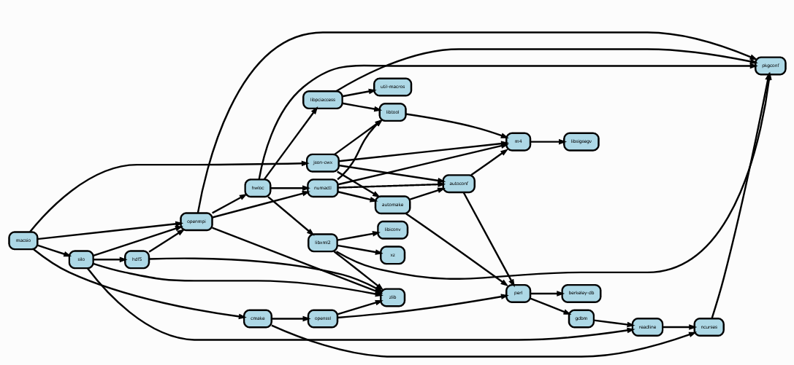

# 開発者ワークフローチュートリアル

> **チュートリアルのセットアップ**
>
> 過去のセクションを完了していない場合は、Spackを次のように設定する必要があります。
>
> ```bash
> git clone https://github.com/spack/spack
> . spack/share/spack/setup-env.sh
> spack tutorial
> ```
>
> セットアップの詳細については、[基本的なインストールチュートリアル](01_basic.md) を参照してください。
> さらにヘルプが必要な場合は、Slackの `#tutorial` チャンネルに参加してください– [spackpm.herokuapp.com](spackpm.herokuapp.com) で招待状を入手してください。

このチュートリアルでは、`spack develop` コマンドをつかって Spack 環境内のローカルソースコードからソフトウェアを開発するプロセスについて説明します。
このコマンドを使い、ライブラリやアプリケーションへの変更のテストに集中しつつ、Spackが依存関係を管理します。

## ローカルソースからのインストール

ご存知のように、 `spack install` コマンドは、パッケージをビルドしてインストールする前に、ミラーまたはインターネットからソースコードをフェッチします。
開発者として、私たちはローカルソースからビルドしたいと考えています。
ローカルソースは常に変更、ビルド、テストされます。

`scr` への取り組みについて、少し想像してみましょう。 
`scr` は、アプリケーションコードにスケーラブルなチェックポインティングを実装するために使用されるライブラリです。
MPIと高帯域幅のファイルI/Oにより、チェックポイントの書き込み/読み取りを迅速かつ効率的にサポートします。
実際のアプリケーション内で `scr` への変更をテストしたいので、典型的なHPC I / Oワークロードを模倣するように作成されたプロキシアプリケーションである `macsio` を使ってテストします。
一緒に使用するとビルドが速いので `scr` と `macsio` を選択しました。

まず、開発のための環境を作ることから始めます。
`macsio` は `scr` サポート付きでビルドする必要があり、当面はFortranサポートなしですべてをビルドしたいと考えています。
そのための開発ワークフローを設定しましょう。

```bash
$ cd ~
$ mkdir devel-env
$ cd devel-env
$ spack env create -d .
==> Updating view at /home/spack/devel-env/.spack-env/view
==> Created environment in /home/spack/devel-env
==> You can activate this environment with:
==>   spack env activate /home/spack/devel-env
$ spack env activate .
$ # for now, disable fortran support in all packages
$ spack config add "packages:all:variants: ~fortran"
$ spack add macsio+scr
==> Adding macsio+scr to environment /home/spack/devel-env
==> Updating view at /home/spack/devel-env/.spack-env/view
$ spack install
==> Concretized macsio+scr
 -   lbkg732  macsio@1.1%gcc@7.5.0~exodus~hdf5~ipo+mpi~pdb+scr+silo~szip~typhonio~zfp~zlib build_type=RelWithDebInfo patches=59479b946e5bbf677e814dc1cde12b38dd3b083fec8c543fc6d3abf9f73dbbfa arch=linux-ubuntu18.04-x86_64
[+]  bltycqw	  ^cmake@3.18.4%gcc@7.5.0~doc+ncurses+openssl+ownlibs~qt patches=bf695e3febb222da2ed94b3beea600650e4318975da90e4a71d6f31a6d5d8c3d arch=linux-ubuntu18.04-x86_64
[+]  crhlefo	      ^ncurses@6.2%gcc@7.5.0~symlinks+termlib arch=linux-ubuntu18.04-x86_64
[+]  4sh6pym		  ^pkgconf@1.7.3%gcc@7.5.0 arch=linux-ubuntu18.04-x86_64
[+]  es377uq	      ^openssl@1.1.1h%gcc@7.5.0+systemcerts arch=linux-ubuntu18.04-x86_64
[+]  zfdvt2j		  ^perl@5.32.0%gcc@7.5.0+cpanm+shared+threads arch=linux-ubuntu18.04-x86_64
[+]  4ihuiaz		      ^berkeley-db@18.1.40%gcc@7.5.0 arch=linux-ubuntu18.04-x86_64
[+]  4av4gyw		      ^gdbm@1.18.1%gcc@7.5.0 arch=linux-ubuntu18.04-x86_64
[+]  t54jzdy			  ^readline@8.0%gcc@7.5.0 arch=linux-ubuntu18.04-x86_64
[+]  smoyzzo		  ^zlib@1.2.11%gcc@7.5.0+optimize+pic+shared arch=linux-ubuntu18.04-x86_64
 -   7tkgwjv	  ^json-cwx@0.12%gcc@7.5.0 arch=linux-ubuntu18.04-x86_64
[+]  mm33a3o	      ^autoconf@2.69%gcc@7.5.0 arch=linux-ubuntu18.04-x86_64
[+]  mkc3u4x		  ^m4@1.4.18%gcc@7.5.0+sigsegv patches=3877ab548f88597ab2327a2230ee048d2d07ace1062efe81fc92e91b7f39cd00,fc9b61654a3ba1a8d6cd78ce087e7c96366c290bc8d2c299f09828d793b853c8 arch=linux-ubuntu18.04-x86_64
[+]  lbrx7ln		      ^libsigsegv@2.12%gcc@7.5.0 arch=linux-ubuntu18.04-x86_64
[+]  d2krmb5	      ^automake@1.16.2%gcc@7.5.0 arch=linux-ubuntu18.04-x86_64
[+]  jdxbjft	      ^libtool@2.4.6%gcc@7.5.0 arch=linux-ubuntu18.04-x86_64
[+]  pmsyupw	  ^openmpi@3.1.6%gcc@7.5.0~atomics~cuda~cxx~cxx_exceptions+gpfs~java~legacylaunchers~lustre~memchecker~pmi~singularity~sqlite3+static~thread_multiple+vt+wrapper-rpath fabrics=none schedulers=none arch=linux-ubuntu18.04-x86_64
[+]  zqwfzhw	      ^hwloc@1.11.11%gcc@7.5.0~cairo~cuda~gl~libudev+libxml2~netloc~nvml+pci+shared arch=linux-ubuntu18.04-x86_64
[+]  bob4o5m		  ^libpciaccess@0.16%gcc@7.5.0 arch=linux-ubuntu18.04-x86_64
[+]  gs6ag7k		      ^util-macros@1.19.1%gcc@7.5.0 arch=linux-ubuntu18.04-x86_64
[+]  yn2r3wf		  ^libxml2@2.9.10%gcc@7.5.0~python arch=linux-ubuntu18.04-x86_64
[+]  jearpk4		      ^libiconv@1.16%gcc@7.5.0 arch=linux-ubuntu18.04-x86_64
[+]  komekkm		      ^xz@5.2.5%gcc@7.5.0~pic arch=linux-ubuntu18.04-x86_64
[+]  wbqbc5v		  ^numactl@2.0.14%gcc@7.5.0 patches=4e1d78cbbb85de625bad28705e748856033eaafab92a66dffd383a3d7e00cc94 arch=linux-ubuntu18.04-x86_64
 -   sqm6ik6	  ^scr@2.0.0%gcc@7.5.0+dtcmp~fortran~ipo+libyogrt async_api=NONE build_type=RelWithDebInfo cache_base=/tmp cntl_base=/tmp copy_config=none file_lock=FLOCK resource_manager=SLURM scr_config=scr.conf arch=linux-ubuntu18.04-x86_64
 -   fxiami4	      ^dtcmp@1.1.1%gcc@7.5.0 arch=linux-ubuntu18.04-x86_64
 -   tzf27nc		  ^lwgrp@1.0.3%gcc@7.5.0 arch=linux-ubuntu18.04-x86_64
 -   ld352tm	      ^libyogrt@1.24%gcc@7.5.0~static scheduler=system arch=linux-ubuntu18.04-x86_64
 -   pv3zp64	      ^pdsh@2.31%gcc@7.5.0+ssh+static_modules arch=linux-ubuntu18.04-x86_64
 -   vfrf7as	  ^silo@4.10.2%gcc@7.5.0~fortran+mpi+pic+shared~silex patches=7b5a1dc2a0e358e667088d77e7caa780967fa8ea60be89c44986605df9990abe arch=linux-ubuntu18.04-x86_64
[+]  vedchc5	      ^hdf5@1.10.7%gcc@7.5.0~cxx~debug~fortran~hl~java+mpi+pic+shared~szip~threadsafe api=none arch=linux-ubuntu18.04-x86_64

==> Installing environment /home/spack/devel-env
[+] /home/spack/spack/opt/spack/linux-ubuntu18.04-x86_64/gcc-7.5.0/pkgconf-1.7.3-4sh6pymrm2ms4auu3ajbjjr6fiuhz5g7
[+] /home/spack/spack/opt/spack/linux-ubuntu18.04-x86_64/gcc-7.5.0/berkeley-db-18.1.40-4ihuiazsglf22f3pntq5hc4kyszqzexn
[+] /home/spack/spack/opt/spack/linux-ubuntu18.04-x86_64/gcc-7.5.0/zlib-1.2.11-smoyzzo2qhzpn6mg6rd3l2p7b23enshg
[+] /home/spack/spack/opt/spack/linux-ubuntu18.04-x86_64/gcc-7.5.0/libsigsegv-2.12-lbrx7lnfz46ukewxbhxnucmx76g23c6q
[+] /home/spack/spack/opt/spack/linux-ubuntu18.04-x86_64/gcc-7.5.0/util-macros-1.19.1-gs6ag7ktdoiirb62t7bcagjw62szrrg2
[+] /home/spack/spack/opt/spack/linux-ubuntu18.04-x86_64/gcc-7.5.0/libiconv-1.16-jearpk4xci4zc7dkrza4fufaqfkq7rfl
[+] /home/spack/spack/opt/spack/linux-ubuntu18.04-x86_64/gcc-7.5.0/xz-5.2.5-komekkmyciga3kl24edjmredhj3uyt7v
==> Installing libyogrt-1.24-ld352tmlkqdjwucj2u5g4fktj2ab2xte
==> Fetching file:///mirror/build_cache/linux-ubuntu18.04-x86_64/gcc-7.5.0/libyogrt-1.24/linux-ubuntu18.04-x86_64-gcc-7.5.0-libyogrt-1.24-ld352tmlkqdjwucj2u5g4fktj2ab2xte.spack
 ################################################################################################ 100.0%
==> Extracting libyogrt-1.24-ld352tmlkqdjwucj2u5g4fktj2ab2xte from binary cache
[+] /home/spack/spack/opt/spack/linux-ubuntu18.04-x86_64/gcc-7.5.0/libyogrt-1.24-ld352tmlkqdjwucj2u5g4fktj2ab2xte
==> Installing pdsh-2.31-pv3zp64j5luhresoommun73mk5joqpb5
==> Fetching file:///mirror/build_cache/linux-ubuntu18.04-x86_64/gcc-7.5.0/pdsh-2.31/linux-ubuntu18.04-x86_64-gcc-7.5.0-pdsh-2.31-pv3zp64j5luhresoommun73mk5joqpb5.spack
 ################################################################################################ 100.0%
==> Extracting pdsh-2.31-pv3zp64j5luhresoommun73mk5joqpb5 from binary cache
[+] /home/spack/spack/opt/spack/linux-ubuntu18.04-x86_64/gcc-7.5.0/pdsh-2.31-pv3zp64j5luhresoommun73mk5joqpb5
[+] /home/spack/spack/opt/spack/linux-ubuntu18.04-x86_64/gcc-7.5.0/ncurses-6.2-crhlefo3dv7lmsv5pf4icsy4gepkdorm
[+] /home/spack/spack/opt/spack/linux-ubuntu18.04-x86_64/gcc-7.5.0/m4-1.4.18-mkc3u4x2p2wie6jfhuku7g5rkovcrxps
[+] /home/spack/spack/opt/spack/linux-ubuntu18.04-x86_64/gcc-7.5.0/libxml2-2.9.10-yn2r3wfhiilelyulh5toteicdtxjhw7d
[+] /home/spack/spack/opt/spack/linux-ubuntu18.04-x86_64/gcc-7.5.0/readline-8.0-t54jzdy2jj4snltjazlm3br2urcilc6v
[+] /home/spack/spack/opt/spack/linux-ubuntu18.04-x86_64/gcc-7.5.0/libtool-2.4.6-jdxbjftheiotj6solpomva7dowrhlerl
[+] /home/spack/spack/opt/spack/linux-ubuntu18.04-x86_64/gcc-7.5.0/gdbm-1.18.1-4av4gywgpaspkhy3dvbb62nulqogtzbb
[+] /home/spack/spack/opt/spack/linux-ubuntu18.04-x86_64/gcc-7.5.0/libpciaccess-0.16-bob4o5m3uku6vtdil5imasprgy775zg7
[+] /home/spack/spack/opt/spack/linux-ubuntu18.04-x86_64/gcc-7.5.0/perl-5.32.0-zfdvt2jjuaees43ffrrtphqs2ky3o22t
[+] /home/spack/spack/opt/spack/linux-ubuntu18.04-x86_64/gcc-7.5.0/autoconf-2.69-mm33a3ocsv3jsh2tfxc4mlab4xsurtdd
[+] /home/spack/spack/opt/spack/linux-ubuntu18.04-x86_64/gcc-7.5.0/openssl-1.1.1h-es377uqsqougfc67jyg7yfjyyuukin52
[+] /home/spack/spack/opt/spack/linux-ubuntu18.04-x86_64/gcc-7.5.0/automake-1.16.2-d2krmb5gweivlnztcymhklzsqbrpatt6
[+] /home/spack/spack/opt/spack/linux-ubuntu18.04-x86_64/gcc-7.5.0/cmake-3.18.4-bltycqwh5oofai4f6o42q4uuj4w5zb3j
[+] /home/spack/spack/opt/spack/linux-ubuntu18.04-x86_64/gcc-7.5.0/numactl-2.0.14-wbqbc5vw5sxzwhvu56p6x5nd5n4abrvh
==> Installing json-cwx-0.12-7tkgwjvu2mi4ea2wsdetunq7g4k4r2nh
==> Fetching file:///mirror/build_cache/linux-ubuntu18.04-x86_64/gcc-7.5.0/json-cwx-0.12/linux-ubuntu18.04-x86_64-gcc-7.5.0-json-cwx-0.12-7tkgwjvu2mi4ea2wsdetunq7g4k4r2nh.spack
 ################################################################################################ 100.0%
==> Extracting json-cwx-0.12-7tkgwjvu2mi4ea2wsdetunq7g4k4r2nh from binary cache
[+] /home/spack/spack/opt/spack/linux-ubuntu18.04-x86_64/gcc-7.5.0/json-cwx-0.12-7tkgwjvu2mi4ea2wsdetunq7g4k4r2nh
[+] /home/spack/spack/opt/spack/linux-ubuntu18.04-x86_64/gcc-7.5.0/hwloc-1.11.11-zqwfzhw5k2ollygh6nrjpsi7u4d4g6lu
[+] /home/spack/spack/opt/spack/linux-ubuntu18.04-x86_64/gcc-7.5.0/openmpi-3.1.6-pmsyupw6w3gql4loaor25gfumlmvkl25
==> Installing lwgrp-1.0.3-tzf27ncg7jccpnayixks4hlam3wpv4wy
==> Fetching file:///mirror/build_cache/linux-ubuntu18.04-x86_64/gcc-7.5.0/lwgrp-1.0.3/linux-ubuntu18.04-x86_64-gcc-7.5.0-lwgrp-1.0.3-tzf27ncg7jccpnayixks4hlam3wpv4wy.spack
 ################################################################################################ 100.0%
==> Extracting lwgrp-1.0.3-tzf27ncg7jccpnayixks4hlam3wpv4wy from binary cache
[+] /home/spack/spack/opt/spack/linux-ubuntu18.04-x86_64/gcc-7.5.0/lwgrp-1.0.3-tzf27ncg7jccpnayixks4hlam3wpv4wy
[+] /home/spack/spack/opt/spack/linux-ubuntu18.04-x86_64/gcc-7.5.0/hdf5-1.10.7-vedchc5aoqyu3ydbp346qrbpe6kg46rq
==> Installing dtcmp-1.1.1-fxiami4ydeszdv55txp4zfin3kzfvpc7
==> Fetching file:///mirror/build_cache/linux-ubuntu18.04-x86_64/gcc-7.5.0/dtcmp-1.1.1/linux-ubuntu18.04-x86_64-gcc-7.5.0-dtcmp-1.1.1-fxiami4ydeszdv55txp4zfin3kzfvpc7.spack
 ################################################################################################ 100.0%
==> Extracting dtcmp-1.1.1-fxiami4ydeszdv55txp4zfin3kzfvpc7 from binary cache
[+] /home/spack/spack/opt/spack/linux-ubuntu18.04-x86_64/gcc-7.5.0/dtcmp-1.1.1-fxiami4ydeszdv55txp4zfin3kzfvpc7
==> Installing silo-4.10.2-vfrf7asfclt7epufnoxibfqbkntbk5k3
==> Fetching file:///mirror/build_cache/linux-ubuntu18.04-x86_64/gcc-7.5.0/silo-4.10.2/linux-ubuntu18.04-x86_64-gcc-7.5.0-silo-4.10.2-vfrf7asfclt7epufnoxibfqbkntbk5k3.spack
 ################################################################################################ 100.0%
==> Extracting silo-4.10.2-vfrf7asfclt7epufnoxibfqbkntbk5k3 from binary cache
[+] /home/spack/spack/opt/spack/linux-ubuntu18.04-x86_64/gcc-7.5.0/silo-4.10.2-vfrf7asfclt7epufnoxibfqbkntbk5k3
==> Installing scr-2.0.0-sqm6ik6bttfz52bgcfhvgucuwegiucqz
==> Fetching file:///mirror/build_cache/linux-ubuntu18.04-x86_64/gcc-7.5.0/scr-2.0.0/linux-ubuntu18.04-x86_64-gcc-7.5.0-scr-2.0.0-sqm6ik6bttfz52bgcfhvgucuwegiucqz.spack
 ################################################################################################ 100.0%
==> Extracting scr-2.0.0-sqm6ik6bttfz52bgcfhvgucuwegiucqz from binary cache
[+] /home/spack/spack/opt/spack/linux-ubuntu18.04-x86_64/gcc-7.5.0/scr-2.0.0-sqm6ik6bttfz52bgcfhvgucuwegiucqz
==> Installing macsio-1.1-lbkg732hoehcrvf6o3sfoi2pz7ie3c4o
==> Fetching file:///mirror/build_cache/linux-ubuntu18.04-x86_64/gcc-7.5.0/macsio-1.1/linux-ubuntu18.04-x86_64-gcc-7.5.0-macsio-1.1-lbkg732hoehcrvf6o3sfoi2pz7ie3c4o.spack
 ################################################################################################ 100.0%
==> Extracting macsio-1.1-lbkg732hoehcrvf6o3sfoi2pz7ie3c4o from binary cache
[+] /home/spack/spack/opt/spack/linux-ubuntu18.04-x86_64/gcc-7.5.0/macsio-1.1-lbkg732hoehcrvf6o3sfoi2pz7ie3c4o
==> Updating view at /home/spack/devel-env/.spack-env/view
==> Updating view at /home/spack/devel-env/.spack-env/view
```

作業を行う前に、これがすべてビルドされていることを確認します。
Spackは、最終的に以下の開発ツリー全体を構築し、すべてをリンクします。



これで、実際のアプリケーションの作業を開始する準備が整いました。

## 開発反復サイクル

ここでは、`scr` にバグがあると仮定し、`scr` にパッチを適用して問題が何であるかを調べたいと考えているとします。
まず最初に、`scr` の開発バージョンをチェックアウトしたいことをspackに伝えます：

```bash
$ spack develop scr@2.0.0
==> Configuring spec scr@2.0.0 for development at path scr
==> Fetching https://spack-llnl-mirror.s3-us-west-2.amazonaws.com/_source-cache/archive/47/471978ae0afb56a20847d3989b994fbd680d1dea21e77a5a46a964b6e3deed6b.tar.gz
 ################################################################################################ 100.0%
==> Updating view at /home/spack/devel-env/.spack-env/view
$ grep -3 develop: spack.yaml
  packages:
    all:
      variants: ~fortran
  develop:
    scr:
      spec: scr@2.0.0
```

`spack develop` コマンドは、パッケージを `spack.yaml` の「開発」パッケージとしてマークします。
このコマンドより、パッケージの仕様に特別な `dev_path=` 属性が追加されるため、spackはこのパッケージのソースコードがどこにあるかを記憶します。
`spack develop` コマンドは、パッケージのソースコードもダウンロード/チェックアウトします。
デフォルトでは、ソースコードは環境のサブディレクトリにダウンロードされます。
環境内の開発構成の `path:` 属性を変更することにより、このソースディレクトリの場所を変更できます。

`spack develop` コマンドには2つの落とし穴があります。

- パッケージを開発パッケージとして指定する場合は、パッケージのバージョンを手動で指定する必要があります。Spackは、パッケージのビルドシステムに正しいフラグを提供できるように、devパッケージのバージョンを知る必要があります。
- バージョン番号と `dev_path=` 属性が `spack.lock` のキャッシュされた仕様に適切に追加されるように、環境を再具現(concrete)化する必要があります。

```bash
$ spack concretize -f
==> Concretized macsio+scr
 -   6x6pqmr  macsio@1.1%gcc@7.5.0~exodus~hdf5~ipo+mpi~pdb+scr+silo~szip~typhonio~zfp~zlib build_type=RelWithDebInfo patches=59479b946e5bbf677e814dc1cde12b38dd3b083fec8c543fc6d3abf9f73dbbfa arch=linux-ubuntu18.04-x86_64
[+]  bltycqw	  ^cmake@3.18.4%gcc@7.5.0~doc+ncurses+openssl+ownlibs~qt patches=bf695e3febb222da2ed94b3beea600650e4318975da90e4a71d6f31a6d5d8c3d arch=linux-ubuntu18.04-x86_64
[+]  crhlefo	      ^ncurses@6.2%gcc@7.5.0~symlinks+termlib arch=linux-ubuntu18.04-x86_64
[+]  4sh6pym		  ^pkgconf@1.7.3%gcc@7.5.0 arch=linux-ubuntu18.04-x86_64
[+]  es377uq	      ^openssl@1.1.1h%gcc@7.5.0+systemcerts arch=linux-ubuntu18.04-x86_64
[+]  zfdvt2j		  ^perl@5.32.0%gcc@7.5.0+cpanm+shared+threads arch=linux-ubuntu18.04-x86_64
[+]  4ihuiaz		      ^berkeley-db@18.1.40%gcc@7.5.0 arch=linux-ubuntu18.04-x86_64
[+]  4av4gyw		      ^gdbm@1.18.1%gcc@7.5.0 arch=linux-ubuntu18.04-x86_64
[+]  t54jzdy			  ^readline@8.0%gcc@7.5.0 arch=linux-ubuntu18.04-x86_64
[+]  smoyzzo		  ^zlib@1.2.11%gcc@7.5.0+optimize+pic+shared arch=linux-ubuntu18.04-x86_64
[+]  7tkgwjv	  ^json-cwx@0.12%gcc@7.5.0 arch=linux-ubuntu18.04-x86_64
[+]  mm33a3o	      ^autoconf@2.69%gcc@7.5.0 arch=linux-ubuntu18.04-x86_64
[+]  mkc3u4x		  ^m4@1.4.18%gcc@7.5.0+sigsegv patches=3877ab548f88597ab2327a2230ee048d2d07ace1062efe81fc92e91b7f39cd00,fc9b61654a3ba1a8d6cd78ce087e7c96366c290bc8d2c299f09828d793b853c8 arch=linux-ubuntu18.04-x86_64
[+]  lbrx7ln		      ^libsigsegv@2.12%gcc@7.5.0 arch=linux-ubuntu18.04-x86_64
[+]  d2krmb5	      ^automake@1.16.2%gcc@7.5.0 arch=linux-ubuntu18.04-x86_64
[+]  jdxbjft	      ^libtool@2.4.6%gcc@7.5.0 arch=linux-ubuntu18.04-x86_64
[+]  pmsyupw	  ^openmpi@3.1.6%gcc@7.5.0~atomics~cuda~cxx~cxx_exceptions+gpfs~java~legacylaunchers~lustre~memchecker~pmi~singularity~sqlite3+static~thread_multiple+vt+wrapper-rpath fabrics=none schedulers=none arch=linux-ubuntu18.04-x86_64
[+]  zqwfzhw	      ^hwloc@1.11.11%gcc@7.5.0~cairo~cuda~gl~libudev+libxml2~netloc~nvml+pci+shared arch=linux-ubuntu18.04-x86_64
[+]  bob4o5m		  ^libpciaccess@0.16%gcc@7.5.0 arch=linux-ubuntu18.04-x86_64
[+]  gs6ag7k		      ^util-macros@1.19.1%gcc@7.5.0 arch=linux-ubuntu18.04-x86_64
[+]  yn2r3wf		  ^libxml2@2.9.10%gcc@7.5.0~python arch=linux-ubuntu18.04-x86_64
[+]  jearpk4		      ^libiconv@1.16%gcc@7.5.0 arch=linux-ubuntu18.04-x86_64
[+]  komekkm		      ^xz@5.2.5%gcc@7.5.0~pic arch=linux-ubuntu18.04-x86_64
[+]  wbqbc5v		  ^numactl@2.0.14%gcc@7.5.0 patches=4e1d78cbbb85de625bad28705e748856033eaafab92a66dffd383a3d7e00cc94 arch=linux-ubuntu18.04-x86_64
 -   jlvvs27	  ^scr@2.0.0%gcc@7.5.0+dtcmp~fortran~ipo+libyogrt async_api=NONE build_type=RelWithDebInfo cache_base=/tmp cntl_base=/tmp copy_config=none dev_path=/home/spack/devel-env/scr file_lock=FLOCK resource_manager=SLURM scr_config=scr.conf arch=linux-ubuntu18.04-x86_64
[+]  fxiami4	      ^dtcmp@1.1.1%gcc@7.5.0 arch=linux-ubuntu18.04-x86_64
[+]  tzf27nc		  ^lwgrp@1.0.3%gcc@7.5.0 arch=linux-ubuntu18.04-x86_64
[+]  ld352tm	      ^libyogrt@1.24%gcc@7.5.0~static scheduler=system arch=linux-ubuntu18.04-x86_64
[+]  pv3zp64	      ^pdsh@2.31%gcc@7.5.0+ssh+static_modules arch=linux-ubuntu18.04-x86_64
[+]  vfrf7as	  ^silo@4.10.2%gcc@7.5.0~fortran+mpi+pic+shared~silex patches=7b5a1dc2a0e358e667088d77e7caa780967fa8ea60be89c44986605df9990abe arch=linux-ubuntu18.04-x86_64
[+]  vedchc5	      ^hdf5@1.10.7%gcc@7.5.0~cxx~debug~fortran~hl~java+mpi+pic+shared~szip~threadsafe api=none arch=linux-ubuntu18.04-x86_64

==> Updating view at /home/spack/devel-env/.spack-env/view
```

これを実行し、`spack install` を実行することで `scr` と `macsio` の両方を再ビルドするように Spack へ伝達します。

```bash
$ spack install
==> Installing environment /home/spack/devel-env
[+] /home/spack/spack/opt/spack/linux-ubuntu18.04-x86_64/gcc-7.5.0/pkgconf-1.7.3-4sh6pymrm2ms4auu3ajbjjr6fiuhz5g7
[+] /home/spack/spack/opt/spack/linux-ubuntu18.04-x86_64/gcc-7.5.0/berkeley-db-18.1.40-4ihuiazsglf22f3pntq5hc4kyszqzexn
[+] /home/spack/spack/opt/spack/linux-ubuntu18.04-x86_64/gcc-7.5.0/zlib-1.2.11-smoyzzo2qhzpn6mg6rd3l2p7b23enshg
[+] /home/spack/spack/opt/spack/linux-ubuntu18.04-x86_64/gcc-7.5.0/libsigsegv-2.12-lbrx7lnfz46ukewxbhxnucmx76g23c6q
[+] /home/spack/spack/opt/spack/linux-ubuntu18.04-x86_64/gcc-7.5.0/util-macros-1.19.1-gs6ag7ktdoiirb62t7bcagjw62szrrg2
[+] /home/spack/spack/opt/spack/linux-ubuntu18.04-x86_64/gcc-7.5.0/libiconv-1.16-jearpk4xci4zc7dkrza4fufaqfkq7rfl
[+] /home/spack/spack/opt/spack/linux-ubuntu18.04-x86_64/gcc-7.5.0/xz-5.2.5-komekkmyciga3kl24edjmredhj3uyt7v
[+] /home/spack/spack/opt/spack/linux-ubuntu18.04-x86_64/gcc-7.5.0/libyogrt-1.24-ld352tmlkqdjwucj2u5g4fktj2ab2xte
[+] /home/spack/spack/opt/spack/linux-ubuntu18.04-x86_64/gcc-7.5.0/pdsh-2.31-pv3zp64j5luhresoommun73mk5joqpb5
[+] /home/spack/spack/opt/spack/linux-ubuntu18.04-x86_64/gcc-7.5.0/ncurses-6.2-crhlefo3dv7lmsv5pf4icsy4gepkdorm
[+] /home/spack/spack/opt/spack/linux-ubuntu18.04-x86_64/gcc-7.5.0/m4-1.4.18-mkc3u4x2p2wie6jfhuku7g5rkovcrxps
[+] /home/spack/spack/opt/spack/linux-ubuntu18.04-x86_64/gcc-7.5.0/libxml2-2.9.10-yn2r3wfhiilelyulh5toteicdtxjhw7d
[+] /home/spack/spack/opt/spack/linux-ubuntu18.04-x86_64/gcc-7.5.0/readline-8.0-t54jzdy2jj4snltjazlm3br2urcilc6v
[+] /home/spack/spack/opt/spack/linux-ubuntu18.04-x86_64/gcc-7.5.0/libtool-2.4.6-jdxbjftheiotj6solpomva7dowrhlerl
[+] /home/spack/spack/opt/spack/linux-ubuntu18.04-x86_64/gcc-7.5.0/gdbm-1.18.1-4av4gywgpaspkhy3dvbb62nulqogtzbb
[+] /home/spack/spack/opt/spack/linux-ubuntu18.04-x86_64/gcc-7.5.0/libpciaccess-0.16-bob4o5m3uku6vtdil5imasprgy775zg7
[+] /home/spack/spack/opt/spack/linux-ubuntu18.04-x86_64/gcc-7.5.0/perl-5.32.0-zfdvt2jjuaees43ffrrtphqs2ky3o22t
[+] /home/spack/spack/opt/spack/linux-ubuntu18.04-x86_64/gcc-7.5.0/openssl-1.1.1h-es377uqsqougfc67jyg7yfjyyuukin52
[+] /home/spack/spack/opt/spack/linux-ubuntu18.04-x86_64/gcc-7.5.0/autoconf-2.69-mm33a3ocsv3jsh2tfxc4mlab4xsurtdd
[+] /home/spack/spack/opt/spack/linux-ubuntu18.04-x86_64/gcc-7.5.0/cmake-3.18.4-bltycqwh5oofai4f6o42q4uuj4w5zb3j
[+] /home/spack/spack/opt/spack/linux-ubuntu18.04-x86_64/gcc-7.5.0/automake-1.16.2-d2krmb5gweivlnztcymhklzsqbrpatt6
[+] /home/spack/spack/opt/spack/linux-ubuntu18.04-x86_64/gcc-7.5.0/numactl-2.0.14-wbqbc5vw5sxzwhvu56p6x5nd5n4abrvh
[+] /home/spack/spack/opt/spack/linux-ubuntu18.04-x86_64/gcc-7.5.0/json-cwx-0.12-7tkgwjvu2mi4ea2wsdetunq7g4k4r2nh
[+] /home/spack/spack/opt/spack/linux-ubuntu18.04-x86_64/gcc-7.5.0/hwloc-1.11.11-zqwfzhw5k2ollygh6nrjpsi7u4d4g6lu
[+] /home/spack/spack/opt/spack/linux-ubuntu18.04-x86_64/gcc-7.5.0/openmpi-3.1.6-pmsyupw6w3gql4loaor25gfumlmvkl25
[+] /home/spack/spack/opt/spack/linux-ubuntu18.04-x86_64/gcc-7.5.0/lwgrp-1.0.3-tzf27ncg7jccpnayixks4hlam3wpv4wy
[+] /home/spack/spack/opt/spack/linux-ubuntu18.04-x86_64/gcc-7.5.0/hdf5-1.10.7-vedchc5aoqyu3ydbp346qrbpe6kg46rq
[+] /home/spack/spack/opt/spack/linux-ubuntu18.04-x86_64/gcc-7.5.0/dtcmp-1.1.1-fxiami4ydeszdv55txp4zfin3kzfvpc7
[+] /home/spack/spack/opt/spack/linux-ubuntu18.04-x86_64/gcc-7.5.0/silo-4.10.2-vfrf7asfclt7epufnoxibfqbkntbk5k3
==> Installing scr-2.0.0-jlvvs27eu2jsvzeobu22z6skocq3fmte
==> No binary for scr-2.0.0-jlvvs27eu2jsvzeobu22z6skocq3fmte found: installing from source
==> scr: Executing phase: 'cmake'
==> scr: Executing phase: 'build'
==> scr: Executing phase: 'install'
[+] /home/spack/spack/opt/spack/linux-ubuntu18.04-x86_64/gcc-7.5.0/scr-2.0.0-jlvvs27eu2jsvzeobu22z6skocq3fmte
==> Installing macsio-1.1-6x6pqmrjajd57kbzgtwgdz3rpozuwzex
==> No binary for macsio-1.1-6x6pqmrjajd57kbzgtwgdz3rpozuwzex found: installing from source
==> Fetching https://spack-llnl-mirror.s3-us-west-2.amazonaws.com/_source-cache/archive/a8/a86249b0f10647c0b631773db69568388094605ec1a0af149d9e61e95e6961ec.tar.gz
 ################################################################################################ 100.0%
==> macsio: Executing phase: 'cmake'
==> macsio: Executing phase: 'build'
==> macsio: Executing phase: 'install'
[+] /home/spack/spack/opt/spack/linux-ubuntu18.04-x86_64/gcc-7.5.0/macsio-1.1-6x6pqmrjajd57kbzgtwgdz3rpozuwzex
==> Updating view at /home/spack/devel-env/.spack-env/view
==> Updating view at /home/spack/devel-env/.spack-env/view
```

これにより、指定したサブディレクトリからscrが再構築されます。
パッケージがcmakeを使用している場合、spackはパッケージのハッシュと一致するビルドディレクトリにパッケージをビルドします。
ここから、適切なディレクトリに移動して、独自のビルド/テストサイクルを実行できます。

これで、コードを開発できます。
このデモのために、意図的にエラーを導入します。
ファイルを編集して、最初に見つかったセミコロンを削除しましょう。

```bash
$ $EDITOR scr/src/scr_copy.c
```

開発パッケージを入手すると、spack install コマンドは「make」のようも動作します。
Spackはパッケージのソースコードディレクトリを知っているため、ソースディレクトリのファイル時間をチェックして、最近変更が加えられたかどうかを確認します。
ファイルタイムスタンプが新しい場合は、`scr` および `scr` に依存するその他のパッケージが再構築されます。

```bash
$ spack install
==> Installing environment /home/spack/devel-env
[+] /home/spack/spack/opt/spack/linux-ubuntu18.04-x86_64/gcc-7.5.0/pkgconf-1.7.3-4sh6pymrm2ms4auu3ajbjjr6fiuhz5g7
[+] /home/spack/spack/opt/spack/linux-ubuntu18.04-x86_64/gcc-7.5.0/berkeley-db-18.1.40-4ihuiazsglf22f3pntq5hc4kyszqzexn
[+] /home/spack/spack/opt/spack/linux-ubuntu18.04-x86_64/gcc-7.5.0/zlib-1.2.11-smoyzzo2qhzpn6mg6rd3l2p7b23enshg
[+] /home/spack/spack/opt/spack/linux-ubuntu18.04-x86_64/gcc-7.5.0/libsigsegv-2.12-lbrx7lnfz46ukewxbhxnucmx76g23c6q
[+] /home/spack/spack/opt/spack/linux-ubuntu18.04-x86_64/gcc-7.5.0/util-macros-1.19.1-gs6ag7ktdoiirb62t7bcagjw62szrrg2
[+] /home/spack/spack/opt/spack/linux-ubuntu18.04-x86_64/gcc-7.5.0/libiconv-1.16-jearpk4xci4zc7dkrza4fufaqfkq7rfl
[+] /home/spack/spack/opt/spack/linux-ubuntu18.04-x86_64/gcc-7.5.0/xz-5.2.5-komekkmyciga3kl24edjmredhj3uyt7v
[+] /home/spack/spack/opt/spack/linux-ubuntu18.04-x86_64/gcc-7.5.0/libyogrt-1.24-ld352tmlkqdjwucj2u5g4fktj2ab2xte
[+] /home/spack/spack/opt/spack/linux-ubuntu18.04-x86_64/gcc-7.5.0/pdsh-2.31-pv3zp64j5luhresoommun73mk5joqpb5
[+] /home/spack/spack/opt/spack/linux-ubuntu18.04-x86_64/gcc-7.5.0/ncurses-6.2-crhlefo3dv7lmsv5pf4icsy4gepkdorm
[+] /home/spack/spack/opt/spack/linux-ubuntu18.04-x86_64/gcc-7.5.0/m4-1.4.18-mkc3u4x2p2wie6jfhuku7g5rkovcrxps
[+] /home/spack/spack/opt/spack/linux-ubuntu18.04-x86_64/gcc-7.5.0/libxml2-2.9.10-yn2r3wfhiilelyulh5toteicdtxjhw7d
[+] /home/spack/spack/opt/spack/linux-ubuntu18.04-x86_64/gcc-7.5.0/readline-8.0-t54jzdy2jj4snltjazlm3br2urcilc6v
[+] /home/spack/spack/opt/spack/linux-ubuntu18.04-x86_64/gcc-7.5.0/libtool-2.4.6-jdxbjftheiotj6solpomva7dowrhlerl
[+] /home/spack/spack/opt/spack/linux-ubuntu18.04-x86_64/gcc-7.5.0/gdbm-1.18.1-4av4gywgpaspkhy3dvbb62nulqogtzbb
[+] /home/spack/spack/opt/spack/linux-ubuntu18.04-x86_64/gcc-7.5.0/libpciaccess-0.16-bob4o5m3uku6vtdil5imasprgy775zg7
[+] /home/spack/spack/opt/spack/linux-ubuntu18.04-x86_64/gcc-7.5.0/perl-5.32.0-zfdvt2jjuaees43ffrrtphqs2ky3o22t
[+] /home/spack/spack/opt/spack/linux-ubuntu18.04-x86_64/gcc-7.5.0/openssl-1.1.1h-es377uqsqougfc67jyg7yfjyyuukin52
[+] /home/spack/spack/opt/spack/linux-ubuntu18.04-x86_64/gcc-7.5.0/autoconf-2.69-mm33a3ocsv3jsh2tfxc4mlab4xsurtdd
[+] /home/spack/spack/opt/spack/linux-ubuntu18.04-x86_64/gcc-7.5.0/cmake-3.18.4-bltycqwh5oofai4f6o42q4uuj4w5zb3j
[+] /home/spack/spack/opt/spack/linux-ubuntu18.04-x86_64/gcc-7.5.0/automake-1.16.2-d2krmb5gweivlnztcymhklzsqbrpatt6
[+] /home/spack/spack/opt/spack/linux-ubuntu18.04-x86_64/gcc-7.5.0/json-cwx-0.12-7tkgwjvu2mi4ea2wsdetunq7g4k4r2nh
[+] /home/spack/spack/opt/spack/linux-ubuntu18.04-x86_64/gcc-7.5.0/numactl-2.0.14-wbqbc5vw5sxzwhvu56p6x5nd5n4abrvh
[+] /home/spack/spack/opt/spack/linux-ubuntu18.04-x86_64/gcc-7.5.0/hwloc-1.11.11-zqwfzhw5k2ollygh6nrjpsi7u4d4g6lu
[+] /home/spack/spack/opt/spack/linux-ubuntu18.04-x86_64/gcc-7.5.0/openmpi-3.1.6-pmsyupw6w3gql4loaor25gfumlmvkl25
[+] /home/spack/spack/opt/spack/linux-ubuntu18.04-x86_64/gcc-7.5.0/lwgrp-1.0.3-tzf27ncg7jccpnayixks4hlam3wpv4wy
[+] /home/spack/spack/opt/spack/linux-ubuntu18.04-x86_64/gcc-7.5.0/hdf5-1.10.7-vedchc5aoqyu3ydbp346qrbpe6kg46rq
[+] /home/spack/spack/opt/spack/linux-ubuntu18.04-x86_64/gcc-7.5.0/dtcmp-1.1.1-fxiami4ydeszdv55txp4zfin3kzfvpc7
[+] /home/spack/spack/opt/spack/linux-ubuntu18.04-x86_64/gcc-7.5.0/silo-4.10.2-vfrf7asfclt7epufnoxibfqbkntbk5k3
==> Installing scr-2.0.0-jlvvs27eu2jsvzeobu22z6skocq3fmte
==> No binary for scr-2.0.0-jlvvs27eu2jsvzeobu22z6skocq3fmte found: installing from source
==> scr: Executing phase: 'cmake'
==> scr: Executing phase: 'build'
==> Error: ProcessError: Command exited with status 2:
    'make' '-j4'

4 errors found in build log:
     178    make[2]: Entering directory '/home/spack/devel-env/scr/spack-build-jlvvs27'
     179    cd /home/spack/devel-env/scr/spack-build-jlvvs27 && /home/spack/spack/opt/spack/linux-ubunt
	    u18.04-x86_64/gcc-7.5.0/cmake-3.18.4-bltycqwh5oofai4f6o42q4uuj4w5zb3j/bin/cmake -E cmake_de
	    pends "Unix Makefiles" /home/spack/devel-env/scr /home/spack/devel-env/scr/src /home/spack/
	    devel-env/scr/spack-build-jlvvs27 /home/spack/devel-env/scr/spack-build-jlvvs27/src /home/s
	    pack/devel-env/scr/spack-build-jlvvs27/src/CMakeFiles/scr_have_restart.dir/DependInfo.cmake
	     --color=
     180    make[2]: Entering directory '/home/spack/devel-env/scr/spack-build-jlvvs27'
     181    cd /home/spack/devel-env/scr/spack-build-jlvvs27 && /home/spack/spack/opt/spack/linux-ubunt
	    u18.04-x86_64/gcc-7.5.0/cmake-3.18.4-bltycqwh5oofai4f6o42q4uuj4w5zb3j/bin/cmake -E cmake_de
	    pends "Unix Makefiles" /home/spack/devel-env/scr /home/spack/devel-env/scr/examples /home/s
	    pack/devel-env/scr/spack-build-jlvvs27 /home/spack/devel-env/scr/spack-build-jlvvs27/exampl
	    es /home/spack/devel-env/scr/spack-build-jlvvs27/examples/CMakeFiles/test_api_multiple.dir/
	    DependInfo.cmake --color=
     182    make[2]: Entering directory '/home/spack/devel-env/scr/spack-build-jlvvs27'
     183    cd /home/spack/devel-env/scr/spack-build-jlvvs27 && /home/spack/spack/opt/spack/linux-ubunt
	    u18.04-x86_64/gcc-7.5.0/cmake-3.18.4-bltycqwh5oofai4f6o42q4uuj4w5zb3j/bin/cmake -E cmake_de
	    pends "Unix Makefiles" /home/spack/devel-env/scr /home/spack/devel-env/scr/examples /home/s
	    pack/devel-env/scr/spack-build-jlvvs27 /home/spack/devel-env/scr/spack-build-jlvvs27/exampl
	    es /home/spack/devel-env/scr/spack-build-jlvvs27/examples/CMakeFiles/test_api.dir/DependInf
	    o.cmake --color=
  >> 184    /home/spack/devel-env/scr/src/scr_copy.c:44:1: error: expected ',' or ';' before 'int'
     185     int print_usage()
     186     ^~~
     187    make[2]: Leaving directory '/home/spack/devel-env/scr/spack-build-jlvvs27'
     188    make  -f src/CMakeFiles/scr_have_restart.dir/build.make src/CMakeFiles/scr_have_restart.dir
	    /build
     189    make[2]: Leaving directory '/home/spack/devel-env/scr/spack-build-jlvvs27'
     190    make  -f examples/CMakeFiles/test_api_multiple.dir/build.make examples/CMakeFiles/test_api_
	    multiple.dir/build

     ...

     198    make[2]: Nothing to be done for 'src/CMakeFiles/scr_have_restart.dir/build'.
     199    make[2]: Leaving directory '/home/spack/devel-env/scr/spack-build-jlvvs27'
     200    make[2]: Leaving directory '/home/spack/devel-env/scr/spack-build-jlvvs27'
     201    make[2]: Leaving directory '/home/spack/devel-env/scr/spack-build-jlvvs27'
     202    make  -f examples/CMakeFiles/test_api.dir/build.make examples/CMakeFiles/test_api.dir/build
     203    src/CMakeFiles/scr_copy.dir/build.make:84: recipe for target 'src/CMakeFiles/scr_copy.dir/s
	    cr_copy.c.o' failed
  >> 204    make[2]: *** [src/CMakeFiles/scr_copy.dir/scr_copy.c.o] Error 1
     205    make[2]: Leaving directory '/home/spack/devel-env/scr/spack-build-jlvvs27'
     206    CMakeFiles/Makefile2:1206: recipe for target 'src/CMakeFiles/scr_copy.dir/all' failed
  >> 207    make[1]: *** [src/CMakeFiles/scr_copy.dir/all] Error 2
     208    make[1]: *** Waiting for unfinished jobs....
     209    [ 85%] Built target scr_have_restart
     210    [ 88%] Built target test_api_multiple
     211    make[2]: Entering directory '/home/spack/devel-env/scr/spack-build-jlvvs27'
     212    make[2]: Nothing to be done for 'examples/CMakeFiles/test_api.dir/build'.
     213    make[2]: Leaving directory '/home/spack/devel-env/scr/spack-build-jlvvs27'
     214    [ 91%] Built target test_api
     215    make[1]: Leaving directory '/home/spack/devel-env/scr/spack-build-jlvvs27'
     216    Makefile:162: recipe for target 'all' failed
  >> 217    make: *** [all] Error 2

See build log for details:
  /home/spack/devel-env/scr/spack-build-out.txt

==> Warning: Skipping build of macsio-1.1-6x6pqmrjajd57kbzgtwgdz3rpozuwzex since scr-2.0.0-jlvvs27eu2jsvzeobu22z6skocq3fmte failed
==> Error: Failed to install scr due to RuntimeError: the transactional move of "/home/spack/spack/opt/spack/linux-ubuntu18.04-x86_64/gcc-7.5.0/scr-2.0.0-jlvvs27eu2jsvzeobu22z6skocq3fmte" failed.
    ProcessError: Command exited with status 2:
    'make' '-j4'
==> Updating view at /home/spack/devel-env/.spack-env/view
==> Updating view at /home/spack/devel-env/.spack-env/view
```

ここでは、ビルドは期待どおりに失敗しました。
`scr/spack-build-out.txt` のビルド出力を見て理由を確認するか、適切な環境変数を使用してシェルを直接起動し、`spack build-env scr@2.0 -- bash` を実行して何が問題だったかを特定できます。
それを覚えるのが多すぎる場合は、`scr/spack-build-env.txt` のソーシングによって適切な環境変数もすべて設定されるため、ビルドを自分で診断できます。
それを修正して直接再ビルドしましょう。

```bash
$ $EDITOR scr/src/scr_copy.c
$ spack install
==> Installing environment /home/spack/devel-env
[+] /home/spack/spack/opt/spack/linux-ubuntu18.04-x86_64/gcc-7.5.0/pkgconf-1.7.3-4sh6pymrm2ms4auu3ajbjjr6fiuhz5g7
[+] /home/spack/spack/opt/spack/linux-ubuntu18.04-x86_64/gcc-7.5.0/berkeley-db-18.1.40-4ihuiazsglf22f3pntq5hc4kyszqzexn
[+] /home/spack/spack/opt/spack/linux-ubuntu18.04-x86_64/gcc-7.5.0/zlib-1.2.11-smoyzzo2qhzpn6mg6rd3l2p7b23enshg
[+] /home/spack/spack/opt/spack/linux-ubuntu18.04-x86_64/gcc-7.5.0/libsigsegv-2.12-lbrx7lnfz46ukewxbhxnucmx76g23c6q
[+] /home/spack/spack/opt/spack/linux-ubuntu18.04-x86_64/gcc-7.5.0/util-macros-1.19.1-gs6ag7ktdoiirb62t7bcagjw62szrrg2
[+] /home/spack/spack/opt/spack/linux-ubuntu18.04-x86_64/gcc-7.5.0/libiconv-1.16-jearpk4xci4zc7dkrza4fufaqfkq7rfl
[+] /home/spack/spack/opt/spack/linux-ubuntu18.04-x86_64/gcc-7.5.0/xz-5.2.5-komekkmyciga3kl24edjmredhj3uyt7v
[+] /home/spack/spack/opt/spack/linux-ubuntu18.04-x86_64/gcc-7.5.0/libyogrt-1.24-ld352tmlkqdjwucj2u5g4fktj2ab2xte
[+] /home/spack/spack/opt/spack/linux-ubuntu18.04-x86_64/gcc-7.5.0/pdsh-2.31-pv3zp64j5luhresoommun73mk5joqpb5
[+] /home/spack/spack/opt/spack/linux-ubuntu18.04-x86_64/gcc-7.5.0/ncurses-6.2-crhlefo3dv7lmsv5pf4icsy4gepkdorm
[+] /home/spack/spack/opt/spack/linux-ubuntu18.04-x86_64/gcc-7.5.0/m4-1.4.18-mkc3u4x2p2wie6jfhuku7g5rkovcrxps
[+] /home/spack/spack/opt/spack/linux-ubuntu18.04-x86_64/gcc-7.5.0/libxml2-2.9.10-yn2r3wfhiilelyulh5toteicdtxjhw7d
[+] /home/spack/spack/opt/spack/linux-ubuntu18.04-x86_64/gcc-7.5.0/readline-8.0-t54jzdy2jj4snltjazlm3br2urcilc6v
[+] /home/spack/spack/opt/spack/linux-ubuntu18.04-x86_64/gcc-7.5.0/libtool-2.4.6-jdxbjftheiotj6solpomva7dowrhlerl
[+] /home/spack/spack/opt/spack/linux-ubuntu18.04-x86_64/gcc-7.5.0/gdbm-1.18.1-4av4gywgpaspkhy3dvbb62nulqogtzbb
[+] /home/spack/spack/opt/spack/linux-ubuntu18.04-x86_64/gcc-7.5.0/libpciaccess-0.16-bob4o5m3uku6vtdil5imasprgy775zg7
[+] /home/spack/spack/opt/spack/linux-ubuntu18.04-x86_64/gcc-7.5.0/perl-5.32.0-zfdvt2jjuaees43ffrrtphqs2ky3o22t
[+] /home/spack/spack/opt/spack/linux-ubuntu18.04-x86_64/gcc-7.5.0/openssl-1.1.1h-es377uqsqougfc67jyg7yfjyyuukin52
[+] /home/spack/spack/opt/spack/linux-ubuntu18.04-x86_64/gcc-7.5.0/autoconf-2.69-mm33a3ocsv3jsh2tfxc4mlab4xsurtdd
[+] /home/spack/spack/opt/spack/linux-ubuntu18.04-x86_64/gcc-7.5.0/cmake-3.18.4-bltycqwh5oofai4f6o42q4uuj4w5zb3j
[+] /home/spack/spack/opt/spack/linux-ubuntu18.04-x86_64/gcc-7.5.0/automake-1.16.2-d2krmb5gweivlnztcymhklzsqbrpatt6
[+] /home/spack/spack/opt/spack/linux-ubuntu18.04-x86_64/gcc-7.5.0/json-cwx-0.12-7tkgwjvu2mi4ea2wsdetunq7g4k4r2nh
[+] /home/spack/spack/opt/spack/linux-ubuntu18.04-x86_64/gcc-7.5.0/numactl-2.0.14-wbqbc5vw5sxzwhvu56p6x5nd5n4abrvh
[+] /home/spack/spack/opt/spack/linux-ubuntu18.04-x86_64/gcc-7.5.0/hwloc-1.11.11-zqwfzhw5k2ollygh6nrjpsi7u4d4g6lu
[+] /home/spack/spack/opt/spack/linux-ubuntu18.04-x86_64/gcc-7.5.0/openmpi-3.1.6-pmsyupw6w3gql4loaor25gfumlmvkl25
[+] /home/spack/spack/opt/spack/linux-ubuntu18.04-x86_64/gcc-7.5.0/lwgrp-1.0.3-tzf27ncg7jccpnayixks4hlam3wpv4wy
[+] /home/spack/spack/opt/spack/linux-ubuntu18.04-x86_64/gcc-7.5.0/hdf5-1.10.7-vedchc5aoqyu3ydbp346qrbpe6kg46rq
[+] /home/spack/spack/opt/spack/linux-ubuntu18.04-x86_64/gcc-7.5.0/dtcmp-1.1.1-fxiami4ydeszdv55txp4zfin3kzfvpc7
[+] /home/spack/spack/opt/spack/linux-ubuntu18.04-x86_64/gcc-7.5.0/silo-4.10.2-vfrf7asfclt7epufnoxibfqbkntbk5k3
==> Installing scr-2.0.0-jlvvs27eu2jsvzeobu22z6skocq3fmte
==> No binary for scr-2.0.0-jlvvs27eu2jsvzeobu22z6skocq3fmte found: installing from source
==> scr: Executing phase: 'cmake'
==> scr: Executing phase: 'build'
==> scr: Executing phase: 'install'
==> Warning: Module file already exists : skipping creation
file : /home/spack/spack/share/spack/modules/linux-ubuntu18.04-x86_64/scr-2.0.0-gcc-7.5.0-jlvvs27
spec : scr@2.0.0%gcc@7.5.0+dtcmp~fortran~ipo+libyogrt async_api=NONE build_type=RelWithDebInfo cache_base=/tmp cntl_base=/tmp copy_config=none dev_path=/home/spack/devel-env/scr file_lock=FLOCK resource_manager=SLURM scr_config=scr.conf arch=linux-ubuntu18.04-x86_64 ^autoconf@2.69%gcc@7.5.0 arch=linux-ubuntu18.04-x86_64 ^automake@1.16.2%gcc@7.5.0 arch=linux-ubuntu18.04-x86_64 ^berkeley-db@18.1.40%gcc@7.5.0 arch=linux-ubuntu18.04-x86_64 ^cmake@3.18.4%gcc@7.5.0~doc+ncurses+openssl+ownlibs~qt patches=bf695e3febb222da2ed94b3beea600650e4318975da90e4a71d6f31a6d5d8c3d arch=linux-ubuntu18.04-x86_64 ^dtcmp@1.1.1%gcc@7.5.0 arch=linux-ubuntu18.04-x86_64 ^gdbm@1.18.1%gcc@7.5.0 arch=linux-ubuntu18.04-x86_64 ^hwloc@1.11.11%gcc@7.5.0~cairo~cuda~gl~libudev+libxml2~netloc~nvml+pci+shared arch=linux-ubuntu18.04-x86_64 ^libiconv@1.16%gcc@7.5.0 arch=linux-ubuntu18.04-x86_64 ^libpciaccess@0.16%gcc@7.5.0 arch=linux-ubuntu18.04-x86_64 ^libsigsegv@2.12%gcc@7.5.0 arch=linux-ubuntu18.04-x86_64 ^libtool@2.4.6%gcc@7.5.0 arch=linux-ubuntu18.04-x86_64 ^libxml2@2.9.10%gcc@7.5.0~python arch=linux-ubuntu18.04-x86_64 ^libyogrt@1.24%gcc@7.5.0~static scheduler=system arch=linux-ubuntu18.04-x86_64 ^lwgrp@1.0.3%gcc@7.5.0 arch=linux-ubuntu18.04-x86_64 ^m4@1.4.18%gcc@7.5.0+sigsegv patches=3877ab548f88597ab2327a2230ee048d2d07ace1062efe81fc92e91b7f39cd00,fc9b61654a3ba1a8d6cd78ce087e7c96366c290bc8d2c299f09828d793b853c8 arch=linux-ubuntu18.04-x86_64 ^ncurses@6.2%gcc@7.5.0~symlinks+termlib arch=linux-ubuntu18.04-x86_64 ^numactl@2.0.14%gcc@7.5.0 patches=4e1d78cbbb85de625bad28705e748856033eaafab92a66dffd383a3d7e00cc94 arch=linux-ubuntu18.04-x86_64 ^openmpi@3.1.6%gcc@7.5.0~atomics~cuda~cxx~cxx_exceptions+gpfs~java~legacylaunchers~lustre~memchecker~pmi~singularity~sqlite3+static~thread_multiple+vt+wrapper-rpath fabrics=none schedulers=none arch=linux-ubuntu18.04-x86_64 ^openssl@1.1.1h%gcc@7.5.0+systemcerts arch=linux-ubuntu18.04-x86_64 ^pdsh@2.31%gcc@7.5.0+ssh+static_modules arch=linux-ubuntu18.04-x86_64 ^perl@5.32.0%gcc@7.5.0+cpanm+shared+threads arch=linux-ubuntu18.04-x86_64 ^pkgconf@1.7.3%gcc@7.5.0 arch=linux-ubuntu18.04-x86_64 ^readline@8.0%gcc@7.5.0 arch=linux-ubuntu18.04-x86_64 ^util-macros@1.19.1%gcc@7.5.0 arch=linux-ubuntu18.04-x86_64 ^xz@5.2.5%gcc@7.5.0~pic arch=linux-ubuntu18.04-x86_64 ^zlib@1.2.11%gcc@7.5.0+optimize+pic+shared arch=linux-ubuntu18.04-x86_64
[+] /home/spack/spack/opt/spack/linux-ubuntu18.04-x86_64/gcc-7.5.0/scr-2.0.0-jlvvs27eu2jsvzeobu22z6skocq3fmte
==> Installing macsio-1.1-6x6pqmrjajd57kbzgtwgdz3rpozuwzex
==> No binary for macsio-1.1-6x6pqmrjajd57kbzgtwgdz3rpozuwzex found: installing from source
==> Using cached archive: /home/spack/spack/var/spack/cache/_source-cache/archive/a8/a86249b0f10647c0b631773db69568388094605ec1a0af149d9e61e95e6961ec.tar.gz
==> macsio: Executing phase: 'cmake'
==> macsio: Executing phase: 'build'
==> macsio: Executing phase: 'install'
==> Warning: Module file already exists : skipping creation
file : /home/spack/spack/share/spack/modules/linux-ubuntu18.04-x86_64/macsio-1.1-gcc-7.5.0-6x6pqmr
spec : macsio@1.1%gcc@7.5.0~exodus~hdf5~ipo+mpi~pdb+scr+silo~szip~typhonio~zfp~zlib build_type=RelWithDebInfo patches=59479b946e5bbf677e814dc1cde12b38dd3b083fec8c543fc6d3abf9f73dbbfa arch=linux-ubuntu18.04-x86_64 ^autoconf@2.69%gcc@7.5.0 arch=linux-ubuntu18.04-x86_64 ^automake@1.16.2%gcc@7.5.0 arch=linux-ubuntu18.04-x86_64 ^berkeley-db@18.1.40%gcc@7.5.0 arch=linux-ubuntu18.04-x86_64 ^cmake@3.18.4%gcc@7.5.0~doc+ncurses+openssl+ownlibs~qt patches=bf695e3febb222da2ed94b3beea600650e4318975da90e4a71d6f31a6d5d8c3d arch=linux-ubuntu18.04-x86_64 ^dtcmp@1.1.1%gcc@7.5.0 arch=linux-ubuntu18.04-x86_64 ^gdbm@1.18.1%gcc@7.5.0 arch=linux-ubuntu18.04-x86_64 ^hdf5@1.10.7%gcc@7.5.0~cxx~debug~fortran~hl~java+mpi+pic+shared~szip~threadsafe api=none arch=linux-ubuntu18.04-x86_64 ^hwloc@1.11.11%gcc@7.5.0~cairo~cuda~gl~libudev+libxml2~netloc~nvml+pci+shared arch=linux-ubuntu18.04-x86_64 ^json-cwx@0.12%gcc@7.5.0 arch=linux-ubuntu18.04-x86_64 ^libiconv@1.16%gcc@7.5.0 arch=linux-ubuntu18.04-x86_64 ^libpciaccess@0.16%gcc@7.5.0 arch=linux-ubuntu18.04-x86_64 ^libsigsegv@2.12%gcc@7.5.0 arch=linux-ubuntu18.04-x86_64 ^libtool@2.4.6%gcc@7.5.0 arch=linux-ubuntu18.04-x86_64 ^libxml2@2.9.10%gcc@7.5.0~python arch=linux-ubuntu18.04-x86_64 ^libyogrt@1.24%gcc@7.5.0~static scheduler=system arch=linux-ubuntu18.04-x86_64 ^lwgrp@1.0.3%gcc@7.5.0 arch=linux-ubuntu18.04-x86_64 ^m4@1.4.18%gcc@7.5.0+sigsegv patches=3877ab548f88597ab2327a2230ee048d2d07ace1062efe81fc92e91b7f39cd00,fc9b61654a3ba1a8d6cd78ce087e7c96366c290bc8d2c299f09828d793b853c8 arch=linux-ubuntu18.04-x86_64 ^ncurses@6.2%gcc@7.5.0~symlinks+termlib arch=linux-ubuntu18.04-x86_64 ^numactl@2.0.14%gcc@7.5.0 patches=4e1d78cbbb85de625bad28705e748856033eaafab92a66dffd383a3d7e00cc94 arch=linux-ubuntu18.04-x86_64 ^openmpi@3.1.6%gcc@7.5.0~atomics~cuda~cxx~cxx_exceptions+gpfs~java~legacylaunchers~lustre~memchecker~pmi~singularity~sqlite3+static~thread_multiple+vt+wrapper-rpath fabrics=none schedulers=none arch=linux-ubuntu18.04-x86_64 ^openssl@1.1.1h%gcc@7.5.0+systemcerts arch=linux-ubuntu18.04-x86_64 ^pdsh@2.31%gcc@7.5.0+ssh+static_modules arch=linux-ubuntu18.04-x86_64 ^perl@5.32.0%gcc@7.5.0+cpanm+shared+threads arch=linux-ubuntu18.04-x86_64 ^pkgconf@1.7.3%gcc@7.5.0 arch=linux-ubuntu18.04-x86_64 ^readline@8.0%gcc@7.5.0 arch=linux-ubuntu18.04-x86_64 ^scr@2.0.0%gcc@7.5.0+dtcmp~fortran~ipo+libyogrt async_api=NONE build_type=RelWithDebInfo cache_base=/tmp cntl_base=/tmp copy_config=none dev_path=/home/spack/devel-env/scr file_lock=FLOCK resource_manager=SLURM scr_config=scr.conf arch=linux-ubuntu18.04-x86_64 ^silo@4.10.2%gcc@7.5.0~fortran+mpi+pic+shared~silex patches=7b5a1dc2a0e358e667088d77e7caa780967fa8ea60be89c44986605df9990abe arch=linux-ubuntu18.04-x86_64 ^util-macros@1.19.1%gcc@7.5.0 arch=linux-ubuntu18.04-x86_64 ^xz@5.2.5%gcc@7.5.0~pic arch=linux-ubuntu18.04-x86_64 ^zlib@1.2.11%gcc@7.5.0+optimize+pic+shared arch=linux-ubuntu18.04-x86_64
[+] /home/spack/spack/opt/spack/linux-ubuntu18.04-x86_64/gcc-7.5.0/macsio-1.1-6x6pqmrjajd57kbzgtwgdz3rpozuwzex
==> Updating view at /home/spack/devel-env/.spack-env/view
==> Updating view at /home/spack/devel-env/.spack-env/view
```

予想どおり、Spack が `scr` と `macsio` の両方を再ビルドしたことを確認できました。

Spackで反復ビルドを利用するには、ビルドシステムの協力が必要です。
Spackが開発パッケージで再構築を実行すると、ソースとビルドディレクトリを元の状態にクリーンアップせずに、パッケージのすべてのビルドステージが再実行されます。
ビルドシステムが以前にコンパイルされたオブジェクトファイルを利用できる場合は、反復ビルドになります。

- パッケージがmakeのみを使用している場合は、`spack develop` 実行時に反復ビルドを無料で入手する必要があります。
- `cmake` / `build` / `install` ビルドステージでの典型的な `cmake` を使用するパッケージであり `cmake` フラグが変更されていない場合は、`cmake` は `CMakeCache.txt` ファイルのタイムスタンプを変更しないため、Spackを使った反復ビルドを無料で入手できます。
- パッケージが `autoconf` を使用している場合、典型的な `autoreconf` ステージを再実行すると、通常 `config.h` ファイルのタイムスタンプが変更され、再ビルドのカスケードがトリガーされる可能性があります。

複数のパッケージを開発マークすることもできます。
`macsio` を共同開発しているなら、次のように実行できます：

```bash
$ spack develop macsio@1.1
==> Configuring spec macsio@1.1 for development at path macsio
==> Using cached archive: /home/spack/spack/var/spack/cache/_source-cache/archive/a8/a86249b0f10647c0b631773db69568388094605ec1a0af149d9e61e95e6961ec.tar.gz
==> Updating view at /home/spack/devel-env/.spack-env/view
$ spack concretize -f
==> Concretized macsio+scr
 -   i7om37w  macsio@1.1%gcc@7.5.0~exodus~hdf5~ipo+mpi~pdb+scr+silo~szip~typhonio~zfp~zlib build_type=RelWithDebInfo dev_path=/home/spack/devel-env/macsio patches=59479b946e5bbf677e814dc1cde12b38dd3b083fec8c543fc6d3abf9f73dbbfa arch=linux-ubuntu18.04-x86_64
[+]  bltycqw	  ^cmake@3.18.4%gcc@7.5.0~doc+ncurses+openssl+ownlibs~qt patches=bf695e3febb222da2ed94b3beea600650e4318975da90e4a71d6f31a6d5d8c3d arch=linux-ubuntu18.04-x86_64
[+]  crhlefo	      ^ncurses@6.2%gcc@7.5.0~symlinks+termlib arch=linux-ubuntu18.04-x86_64
[+]  4sh6pym		  ^pkgconf@1.7.3%gcc@7.5.0 arch=linux-ubuntu18.04-x86_64
[+]  es377uq	      ^openssl@1.1.1h%gcc@7.5.0+systemcerts arch=linux-ubuntu18.04-x86_64
[+]  zfdvt2j		  ^perl@5.32.0%gcc@7.5.0+cpanm+shared+threads arch=linux-ubuntu18.04-x86_64
[+]  4ihuiaz		      ^berkeley-db@18.1.40%gcc@7.5.0 arch=linux-ubuntu18.04-x86_64
[+]  4av4gyw		      ^gdbm@1.18.1%gcc@7.5.0 arch=linux-ubuntu18.04-x86_64
[+]  t54jzdy			  ^readline@8.0%gcc@7.5.0 arch=linux-ubuntu18.04-x86_64
[+]  smoyzzo		  ^zlib@1.2.11%gcc@7.5.0+optimize+pic+shared arch=linux-ubuntu18.04-x86_64
[+]  7tkgwjv	  ^json-cwx@0.12%gcc@7.5.0 arch=linux-ubuntu18.04-x86_64
[+]  mm33a3o	      ^autoconf@2.69%gcc@7.5.0 arch=linux-ubuntu18.04-x86_64
[+]  mkc3u4x		  ^m4@1.4.18%gcc@7.5.0+sigsegv patches=3877ab548f88597ab2327a2230ee048d2d07ace1062efe81fc92e91b7f39cd00,fc9b61654a3ba1a8d6cd78ce087e7c96366c290bc8d2c299f09828d793b853c8 arch=linux-ubuntu18.04-x86_64
[+]  lbrx7ln		      ^libsigsegv@2.12%gcc@7.5.0 arch=linux-ubuntu18.04-x86_64
[+]  d2krmb5	      ^automake@1.16.2%gcc@7.5.0 arch=linux-ubuntu18.04-x86_64
[+]  jdxbjft	      ^libtool@2.4.6%gcc@7.5.0 arch=linux-ubuntu18.04-x86_64
[+]  pmsyupw	  ^openmpi@3.1.6%gcc@7.5.0~atomics~cuda~cxx~cxx_exceptions+gpfs~java~legacylaunchers~lustre~memchecker~pmi~singularity~sqlite3+static~thread_multiple+vt+wrapper-rpath fabrics=none schedulers=none arch=linux-ubuntu18.04-x86_64
[+]  zqwfzhw	      ^hwloc@1.11.11%gcc@7.5.0~cairo~cuda~gl~libudev+libxml2~netloc~nvml+pci+shared arch=linux-ubuntu18.04-x86_64
[+]  bob4o5m		  ^libpciaccess@0.16%gcc@7.5.0 arch=linux-ubuntu18.04-x86_64
[+]  gs6ag7k		      ^util-macros@1.19.1%gcc@7.5.0 arch=linux-ubuntu18.04-x86_64
[+]  yn2r3wf		  ^libxml2@2.9.10%gcc@7.5.0~python arch=linux-ubuntu18.04-x86_64
[+]  jearpk4		      ^libiconv@1.16%gcc@7.5.0 arch=linux-ubuntu18.04-x86_64
[+]  komekkm		      ^xz@5.2.5%gcc@7.5.0~pic arch=linux-ubuntu18.04-x86_64
[+]  wbqbc5v		  ^numactl@2.0.14%gcc@7.5.0 patches=4e1d78cbbb85de625bad28705e748856033eaafab92a66dffd383a3d7e00cc94 arch=linux-ubuntu18.04-x86_64
[+]  jlvvs27	  ^scr@2.0.0%gcc@7.5.0+dtcmp~fortran~ipo+libyogrt async_api=NONE build_type=RelWithDebInfo cache_base=/tmp cntl_base=/tmp copy_config=none dev_path=/home/spack/devel-env/scr file_lock=FLOCK resource_manager=SLURM scr_config=scr.conf arch=linux-ubuntu18.04-x86_64
[+]  fxiami4	      ^dtcmp@1.1.1%gcc@7.5.0 arch=linux-ubuntu18.04-x86_64
[+]  tzf27nc		  ^lwgrp@1.0.3%gcc@7.5.0 arch=linux-ubuntu18.04-x86_64
[+]  ld352tm	      ^libyogrt@1.24%gcc@7.5.0~static scheduler=system arch=linux-ubuntu18.04-x86_64
[+]  pv3zp64	      ^pdsh@2.31%gcc@7.5.0+ssh+static_modules arch=linux-ubuntu18.04-x86_64
[+]  vfrf7as	  ^silo@4.10.2%gcc@7.5.0~fortran+mpi+pic+shared~silex patches=7b5a1dc2a0e358e667088d77e7caa780967fa8ea60be89c44986605df9990abe arch=linux-ubuntu18.04-x86_64
[+]  vedchc5	      ^hdf5@1.10.7%gcc@7.5.0~cxx~debug~fortran~hl~java+mpi+pic+shared~szip~threadsafe api=none arch=linux-ubuntu18.04-x86_64

==> Updating view at /home/spack/devel-env/.spack-env/view
```

開発ワークフローを使用すると、開発プロセス全体をチームの別の開発者に送ることもできます。
`spack.yaml` を取得して新しい環境を作成し、これを使用してビルドプロセスを複製するだけです。
たとえば、ここで別の開発環境を作成してみます：

```bash
$ cd ~
$ mkdir devel-other
$ cd devel-other
$ cp ../devel-env/spack.yaml .
$ spacktivate .
$ spack develop
==> Fetching https://spack-llnl-mirror.s3-us-west-2.amazonaws.com/_source-cache/archive/47/471978ae0afb56a20847d3989b994fbd680d1dea21e77a5a46a964b6e3deed6b.tar.gz
 ################################################################################################ 100.0%
==> Using cached archive: /home/spack/spack/var/spack/cache/_source-cache/archive/a8/a86249b0f10647c0b631773db69568388094605ec1a0af149d9e61e95e6961ec.tar.gz
$ ls
macsio	scr  spack.yaml
```

ここでは、引数なしの `spack develop` でソースコードをチェックアウトまたはダウンロードして、適切な場所に配置します。

開発が完了したら、パッケージの開発バージョンを保持する必要がなくなったことをSpackに通知するだけです：

```bash
$ spack undevelop scr macsio
==> Removing scr from environment /home/spack/devel-other development specs
==> Removing macsio from environment /home/spack/devel-other development specs
==> Updating view at /home/spack/devel-other/.spack-env/view
```

## ワークフローまとめ

任意の環境で `spack develop` コマンドを使用して、開発ワークフロー用の再現可能なビルド環境を作成します。
Spackはすべての依存関係を設定し、すべてのパッケージをリンクします。
開発環境内では、`spack install`　はファイルタイムスタンプをチェックして、ビルドへの変更を反映するために必要な最小数のSpackパッケージを再ビルドするという点で `make` 同様に機能します。
