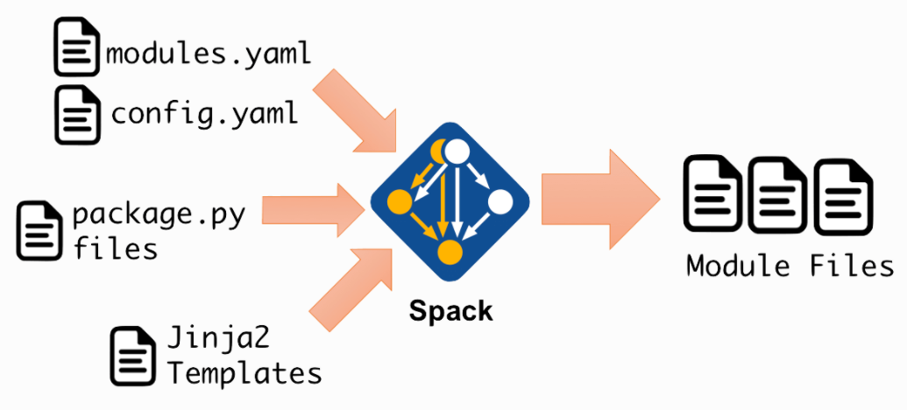

# モジュールファイルチュートリアル

このチュートリアルでは、Spackを使用し、インストールされているソフトウェアのモジュールファイルを生成する方法を解説します。
階層的展開と非階層的展開の両方について詳しく説明し、各モジュールファイルのコンテンツと名前をカスタマイズする方法を示します。

本チュートリアルを実行することで、次のことを理解することができます。

- モジュールファイルとは何か、およびそれらがHPCクラスタでどのように使用されるか
- Spackがインストールするソフトウェアのモジュールファイルを生成する方法
- モジュールファイルの管理に使用できるSpackコマンド
- Spackによって生成されたモジュールファイルをカスタマイズする方法

また Spack は、HPCクラスタへのソフトウェアのインストールを維持管理のすべての一般的なユースケースに対処できることを確認できます。

## チュートリアルのためのセットアップ

チュートリアルの準備として、同じパッケージといくつかの外部パッケージの異なる構成を含む、小さいながらも代表的なソフトウェアのセットをインストールします。
インストールを管理しやすくするために、チュートリアルの前半のすべてをアンインストールすることから始めましょう。

```bash
$ spack uninstall -ay
```

### モジュールツールの作成

最初に必要なのは、モジュールツール自体です。
チュートリアルでは、階層的レイアウトと非階層的レイアウトの両方で機能する `lmod` を使用します。

```bash
$ spack install lmod
```

モジュールツールをインストールしたら、現在のシェルで使用できるようにする必要があります。
Spackのストアのインストールディレクトリは、覚えるのは簡単ではありませんが、`spack location`コマンドで取得できます：

```bash
$ . $(spack location -i lmod)/lmod/lmod/init/bash
```

これで、セットアップファイルを再ソースでき、Spackモジュールがモジュールパスに配置されます。

```bash
$ . share/spack/setup-env.sh
```

### 新しいコンパイラの追加

2番目のステップは、最新コンパイラを構築することです。
Spackは最初の使用時に環境をスキャンし、システムですでに使用可能なコンパイラを自動的に発見します。
ただし、このチュートリアルでは `gcc@8.3.0` を使用することとします。

```bash
$ spack install gcc@8.3.0
```

これは、`spack load gcc@8.3.0` コマンドを使うと環境で取得できます。

```bash
$ spack load gcc@8.3.0
$ which gcc
/home/spack/spack/opt/spack/linux-ubuntu18.04-x86_64/gcc-7.5.0/gcc-8.3.0-6hbkzolzshktgws6mz3f4s23v6sbkgnl/bin/gcc
```

これで、`gcc` への `PATH` が通るようになり、`spack compiler add`コマンドを使ってコンパイラのリストに追加することができます：

```bash
$ spack compiler add
==> Added 1 new compiler to /home/spack/.spack/linux/compilers.yaml
    gcc@8.3.0
==> Compilers are defined in the following files:
    /home/spack/.spack/linux/compilers.yaml
```

```bash
$ spack compiler list
==> Available compilers
-- clang ubuntu18.04-x86_64 -------------------------------------
clang@6.0.0

-- gcc ubuntu18.04-x86_64 ---------------------------------------
gcc@8.3.0  gcc@7.5.0  gcc@6.5.0
```

### チュートリアルで使用するソフトウェアをビルド

最後に Spack を使って、例にて使用するパッケージをインストールします：

```bash
$ spack install netlib-scalapack ^openmpi ^openblas
$ spack install netlib-scalapack ^mpich ^openblas
$ spack install netlib-scalapack ^openmpi ^netlib-lapack
$ spack install netlib-scalapack ^mpich ^netlib-lapack
$ spack install py-scipy ^openblas
```

## モジュールファイルとは何か？

モジュールファイルは、シェルセッション中に制御された方法で環境を変更する簡単な方法です。
通常モジュールファイルには、アプリケーション実行やライブラリ使用に必要な情報が含まれています。
この `module` コマンドは、モジュールファイルを解釈して実行するために使用されます。
たとえば `module show` は、モジュールがロードされたときに何をするかを示します：

```bash
$ module show zlib
----------------------------------------------------------------------------------------------------------------------------------------------
   /home/spack/spack/share/spack/modules/linux-ubuntu18.04-x86_64/zlib/1.2.11-gcc-8.3.0:
----------------------------------------------------------------------------------------------------------------------------------------------
whatis("A free, general-purpose, legally unencumbered lossless data-compression library. ")
conflict("zlib")
prepend_path("MANPATH","/home/spack/spack/opt/spack/linux-ubuntu18.04-x86_64/gcc-8.3.0/zlib-1.2.11-2icaxiyy5rrqdavfv7jbojdq36r6u37n/share/man")
prepend_path("LD_LIBRARY_PATH","/home/spack/spack/opt/spack/linux-ubuntu18.04-x86_64/gcc-8.3.0/zlib-1.2.11-2icaxiyy5rrqdavfv7jbojdq36r6u37n/lib")
prepend_path("INCLUDE","/home/spack/spack/opt/spack/linux-ubuntu18.04-x86_64/gcc-8.3.0/zlib-1.2.11-2icaxiyy5rrqdavfv7jbojdq36r6u37n/include")
prepend_path("PKG_CONFIG_PATH","/home/spack/spack/opt/spack/linux-ubuntu18.04-x86_64/gcc-8.3.0/zlib-1.2.11-2icaxiyy5rrqdavfv7jbojdq36r6u37n/lib/pkgconfig")
prepend_path("CMAKE_PREFIX_PATH","/home/spack/spack/opt/spack/linux-ubuntu18.04-x86_64/gcc-8.3.0/zlib-1.2.11-2icaxiyy5rrqdavfv7jbojdq36r6u37n/")
help([[A free, general-purpose, legally unencumbered lossless data-compression
library.
]])

$ echo $LD_LIBRARY_PATH
```

`module load` を実行すると、上記のすべての変更を実行します：

```bash
$ module load zlib
$ echo $LD_LIBRARY_PATH
/home/spack/spack/opt/spack/linux-ubuntu18.04-x86_64/gcc-8.3.0/zlib-1.2.11-2icaxiyy5rrqdavfv7jbojdq36r6u37n/lib
```

変更を元に戻すには、`module unload` を使います：

```bash
$ module unload zlib
$ echo $LD_LIBRARY_PATH

$
```

### モジュールシステム

HPCで使用されるメインモジュールシステムは2つあり、どちらもSpackでインストールできます。
このチュートリアルでは `lmod` 、TclとLuaの両方を使用して例を示します。

#### 環境モジュール

これはオリジナルのモジュールツールです。
次のコマンドを使用して、Spackをつかってインストールすることができます：

```bash
$ spack install environment-modules
```

1990年代初頭に最初にCでコーディングされ、後にTclで完全に書き直されました。
長い間停滞していたこのプロジェクトは、過去数年間にCEAのXavier Delaruelleによって復活し、現在非常に活発に開発されています。
詳細については、 [ドキュメント](https://modules.readthedocs.io/) を参照してください。

#### Lmod

Lmodは、Luaで記述されたモジュールシステムであり、元々はRobertMcLayによって「TexasAdvancedComputing Center」（TACC）で作成されました。
次のコマンドを実行することで取得できます：

```bash
$ spack install lmod
```

チュートリアルセクションのセットアップでも登場しましたが、これは環境モジュールのドロップイン代替品であり、 TclモジュールファイルとLuaモジュールファイルの両方で機能します。
環境モジュールと完全に互換性がありますが、独自の多くの際立った機能も備えています。
主なものは モジュール階層です。
これは、現在ロードされているコンパイラやMPIでビルドされたモジュールのみを表示することにより、モジュールUIを簡素化します。
いくつかのユニークな安全機能もあります。

## Spack はどのようにしてモジュールファイルを生成するのか？

実践的なセクションに入る前に、モジュールファイルがSpackによってどのように生成されるかを解説します。
次の図は、プロセスの概要を示しています。



Spackのモジュールは、構成ファイル（ `config.yaml` および `modules.yaml` ）、Spackのパッケージレシピからの情報、およびJinja2テンプレートを使用して生成します。
Spackは外部テンプレートエンジン　[Jinja2](http://jinja.pocoo.org/docs/2.9/) から構成されているので、自分でインストールする必要はありません。

### モジュール vs `spack load`

前述の「チュートリアルのセットアップ」セクションで `spack load` 使用していたことに気付いた人もいると思います。
これは Spack の組み込みメカニズムであり、クラスタもしくはラップトップのユーザが簡単にパッケージのパスを通せるように設計されており、Spackの仕様構文を理解します。
モジュールがシステムにセットアップされているかどうかに関係なくSpackが機能する必要があるため、モジュールは必要ありません。

ご想像のとおり、`spack load` や `spack find` を使って何が読み込まれるかを確認することができます：

```bash
$ spack find --loaded
==> 6 installed packages
-- linux-ubuntu18.04-x86_64 / gcc@7.5.0 -------------------------
gcc@8.3.0  gmp@6.1.2  isl@0.18	mpc@1.1.0  mpfr@3.1.6  zlib@1.2.11
```

TBD
