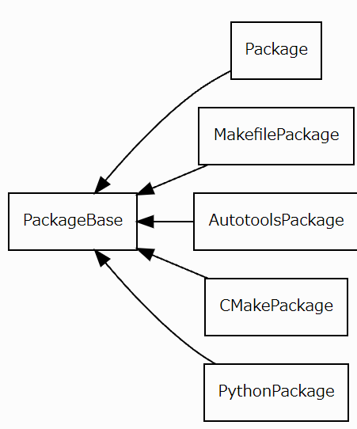

# Spack パッケージビルドシステム

> **チュートリアルのセットアップ**
>
> 過去のセクションを完了していない場合は、Spackを次のように設定する必要があります。
>
> ```bash
> git clone https://github.com/spack/spack
> . spack/share/spack/setup-env.sh
> spack tutorial
> ```
>
> セットアップの詳細については、[基本的なインストールチュートリアル](01_basic.md) を参照してください。
> さらにヘルプが必要な場合は、Slackの `#tutorial` チャンネルに参加してください– [spackpm.herokuapp.com](spackpm.herokuapp.com) で招待状を入手してください。

いくつかのパッケージテンプレートファイルを書き込んだ後、パッケージのいくつかにパターンが現れることに気付くかもしれません。
たとえば、あなた自身が書いかもしれない `install()` メソッドは `configure` 、 `cmake` 、 `make` 、 `make install` を呼び出しています。
`configure` または `cmake` への引数として `"prefix=" + prefix` を記述していることに気付くかもしれません。
Spackには、すべてのパッケージに対してこれらの行を繰り返すのではなく、これらのパターンを処理できるクラスがあります。
さらに、これらのパッケージファイルを使用すると、これらのビルドシステムをよりきめ細かく制御できます。
このセクションでは、各ビルドシステムについて説明し、これらを操作してパッケージをインストールする方法の例を示します。

## Packageクラス階層



上の図は、クラス階層と各パッケージの関係の概要を示しています。
各サブクラスは親クラス `PackageBaseClass` を継承します。
フェッチ、ステージングディレクトリへの抽出、インストールを含む作業の大部分は、この親クラスで行われます。
次に、各サブクラスは、ビルドシステム固有の機能を追加します。
次のセクションでは、各サブクラスを利用する方法の例と、パッケージ化時にこれらの抽象化がどれほど強力であるかを確認します。

## Package

パッケージファイルを作成するためのウォークスルーで `Package` クラスの例をすでに見てきたので、ここではそれらに多くの時間を費やすことはありません。
簡単に言うと、`Package` クラスではビルドプロセスを任意に制御できますが、サブクラスは特定のパターン（例：`configure` 、 `make` 、 `make install` ）に依存しているのであれば有用です。
`Package` クラスは、パッケージャがSpackのヘルパ関数の一部を利用してパッケージのビルドとインストールをカスタマイズできるため、従来とは異なるビルド方法を持つパッケージに特に役立ちます。

## Autotools

前述したように、Autotools　が `configure` 、 `make` および `make install` コマンドを使用してビルドおよびインストールプロセスを実行するパッケージ。
`Package` クラスでは、あなたの典型的なビルドの呪文は以下で構成されます：

```python
def install(self, spec, prefix):
    configure("--prefix=" + prefix)
    make()
    make("install")
```

これは、[パッケージ作成チュートリアル](04_package_creation.md) で解説したものと似ていることがわかります。

`Autotools` サブクラスの目的は、パッケージファイルを書き込み、`Autotools` ビルドシステムの異なるフェーズごとの操作のための便利なメソッド提供を簡素化することです。

`Autotools` パッケージはつぎの4つのフェーズで構成されています：

1. `autoreconf()`
2. `configure()`
3. `build()`
4. `install()`

これらの各フェーズには、適切なデフォルト処理があります。
`Autotools` クラスの内部を簡単に見てみましょう：

```bash
$ spack edit --build-system autotools
```

これにより、テキストエディタで `AutotoolsPackage` ファイルが開きます。

> **注意**
> これらのクラスのコードを示す例は、長くならないように要約されています。
> ここではパッケージャに関連するもののみを示しています。

```python
    #: system base class
    build_system_class = 'AutotoolsPackage'
    #: Whether or not to update ``config.guess`` on old architectures
    patch_config_guess = True

    #: Targets for ``make`` during the :py:meth:`~.AutotoolsPackage.build`
    #: phase
    build_targets = []
    #: Targets for ``make`` during the :py:meth:`~.AutotoolsPackage.install`
    #: phase
    install_targets = ['install']

    #: Callback names for build-time test
    build_time_test_callbacks = ['check']

    #: Callback names for install-time test
    install_time_test_callbacks = ['installcheck']

    #: Set to true to force the autoreconf step even if configure is present
    force_autoreconf = False
    #: Options to be passed to autoreconf when using the default implementation
    autoreconf_extra_args = []

    def configure(self, spec, prefix):
        """Runs configure with the arguments specified in
        :py:meth:`~.AutotoolsPackage.configure_args`
        and an appropriately set prefix.
        """
        options = getattr(self, 'configure_flag_args', [])
        options += ['--prefix={0}'.format(prefix)]
        options += self.configure_args()

        with working_dir(self.build_directory, create=True):
            inspect.getmodule(self).configure(*options)

    def build(self, spec, prefix):
        """Makes the build targets specified by
        :py:attr:``~.AutotoolsPackage.build_targets``
        """
        with working_dir(self.build_directory):
            inspect.getmodule(self).make(*self.build_targets)

```

注意すべき重要な点は、強調表示された行です。
これらのプロパティにより、パッケージャは、パッケージに必要なビルドターゲットとインストールターゲットを設定できます。
たとえば、ビルドターゲットとして `foo` を追加したい場合は、`build_targets` プロパティに追加します：

```python
build_targets = ["foo"]
```

これは、パッケージで `make` を呼び出すのと似ています。

```python
make("foo")
```

これは、環境変数を無視し、コマンドライン引数が必要なパッケージがある場合に役立ちます。

注意すべきもう1つのことは `configure()` メソッドにあります。
ここでは、`Autotools` を使用するパッケージ間で共通のパターンであるため、`prefix` 引数がすでに含まれていることがわかります。
`configure_args()` をオーバーライドするだけで、出力が `configure()` に返されます。
次に `configure(` へ)一般的な引数を追加します。

パッケージャには、`autoreconf` パッケージがビルドシステムを更新し、新しい `configure` を生成する必要がある場合に実行するオプションもあります。
ただし、ほとんどの場合これは不要です。

以前に作業した `mpileaks` のpackage.pyファイルを見てみましょう：

```bash
$ spack edit mpileaks
```

mpileaks は `Package` クラスですが、Autotools ビルドシステムを使用していることに注意してください。
このパッケージは受け入れられますが、これを `AutotoolsPackage` クラスにしてさらに単純化してみましょう。

```python
# Copyright 2013-2021 Lawrence Livermore National Security, LLC and other
# Spack Project Developers. See the top-level COPYRIGHT file for details.
#
# SPDX-License-Identifier: (Apache-2.0 OR MIT)

from spack import *


class Mpileaks(AutotoolsPackage):
    """Tool to detect and report leaked MPI objects like MPI_Requests and
       MPI_Datatypes."""

    homepage = "https://github.com/hpc/mpileaks"
    url      = "https://github.com/hpc/mpileaks/releases/download/v1.0/mpileaks-1.0.tar.gz"

    version('1.0', '8838c574b39202a57d7c2d68692718aa')

    depends_on("mpi")
    depends_on("adept-utils")
    depends_on("callpath")

    def install(self, spec, prefix):
        configure("--prefix=" + prefix,
                  "--with-adept-utils=" + spec['adept-utils'].prefix,
                  "--with-callpath=" + spec['callpath'].prefix)
        make()
        make("install")
```

まず `AutotoolsPackage` クラスを継承します。

`install()` メソッドを保持することはできますが、そのほとんどはベースの `AutotoolsPackage`クラスで処理できます。
実際、オーバーライドする必要があるのは `configure_args()` だけです：

```python
# Copyright 2013-2021 Lawrence Livermore National Security, LLC and other
# Spack Project Developers. See the top-level COPYRIGHT file for details.
#
# SPDX-License-Identifier: (Apache-2.0 OR MIT)

from spack import *


class Mpileaks(AutotoolsPackage):
    """Tool to detect and report leaked MPI objects like MPI_Requests and
       MPI_Datatypes."""

    homepage = "https://github.com/hpc/mpileaks"
    url      = "https://github.com/hpc/mpileaks/releases/download/v1.0/mpileaks-1.0.tar.gz"

    version('1.0', '8838c574b39202a57d7c2d68692718aa')

    variant("stackstart", values=int, default=0,
            description="Specify the number of stack frames to truncate")

    depends_on("mpi")
    depends_on("adept-utils")
    depends_on("callpath")

    def configure_args(self):
        stackstart = int(self.spec.variants['stackstart'].value)
        args = ["--with-adept-utils=" + spec['adept-utils'].prefix,
                "--with-callpath=" + spec['callpath'].prefix]
        if stackstart:
            args.extend(['--with-stack-start-c=%s' % stackstart,
                         '--with-stack-start-fortran=%s' % stackstart])
        return args
```

Spackがprefix設定を処理するので、`configure` への引数として除外できます。
パッケージが簡素になり、そしてパッケージャは `configure` や `make` が適切に含まれているかどうかを心配する必要はありません。

このバージョンの `mpileaks` パッケージは以前と同じようにインストールされますが、`AutotoolsPackage` クラスを使用すると、見た目がすっきりしたパッケージファイルでインストールできます。

## Makefile

プラットフォームやコンパイラ固有の変数を設定するために通常は `Makefile` を編集する必要があるパッケージ。
これらのパッケージは、これらのタイプのパッケージの作成に役立つ便利なメソッドを提供するサブクラス `Makefile` によって処理されます。

`MakefilePackage` クラスは、次のようなオーバライド可能な3つのフェーズがあります：

1. `edit()`
2. `build()`
3. `install()`

パッケージャは、`Makefile` の編集方法、そしてビルドフェーズまたはインストールフェーズに含めるターゲットを制御できます。

`MakefilePackage` クラスの内部も見てみましょう：

```bash
$ spack edit --build-system makefile
```

次の点に注意してください：

```python
class MakefilePackage(PackageBase):
    #: Phases of a package that is built with an hand-written Makefile
    phases = ['edit', 'build', 'install']
    #: This attribute is used in UI queries that need to know the build
    #: system base class
    build_system_class = 'MakefilePackage'

    #: Targets for ``make`` during the :py:meth:`~.MakefilePackage.build`
    #: phase
    build_targets = []
    #: Targets for ``make`` during the :py:meth:`~.MakefilePackage.install`
    #: phase
    install_targets = ['install']

    #: Callback names for build-time test
    build_time_test_callbacks = ['check']

    #: Callback names for install-time test
    install_time_test_callbacks = ['installcheck']

    def edit(self, spec, prefix):
        """Edits the Makefile before calling make. This phase cannot
        be defaulted.
        """
        tty.msg('Using default implementation: skipping edit phase.')

    def build(self, spec, prefix):
        """Calls make, passing :py:attr:`~.MakefilePackage.build_targets`
        as targets.
        """
        with working_dir(self.build_directory):
            inspect.getmodule(self).make(*self.build_targets)

    def install(self, spec, prefix):
        """Calls make, passing :py:attr:`~.MakefilePackage.install_targets`
        as targets.
        """
        with working_dir(self.build_directory):
            inspect.getmodule(self).make(*self.install_targets)
```

`Autotools` と同様に、 `MakefilePackage` クラスにはパッケージャが設定できるプロパティがあります。
強調表示されているさまざまなメソッドをオーバーライドすることもできます。

[Bowtie](http://bowtie-bio.sourceforge.net/index.shtml) パッケージを再作成してみましょう：

```bash
$ spack create -f https://downloads.sourceforge.net/project/bowtie-bio/bowtie/1.2.1.1/bowtie-1.2.1.1-src.zip
==> This looks like a URL for bowtie
==> Found 1 version of bowtie:

1.2.1.1  https://downloads.sourceforge.net/project/bowtie-bio/bowtie/1.2.1.1/bowtie-1.2.1.1-src.zip

==> How many would you like to checksum? (default is 1, q to abort) 1
==> Downloading...
==> Fetching https://downloads.sourceforge.net/project/bowtie-bio/bowtie/1.2.1.1/bowtie-1.2.1.1-src.zip
######################################################################## 100.0%
==> Checksummed 1 version of bowtie
==> This package looks like it uses the makefile build system
==> Created template for bowtie package
==> Created package file: /Users/mamelara/spack/var/spack/repos/builtin/packages/bowtie/package.py
```

フェッチが完了すると、Spackは通常の方法でテキストエディタを開き、`MakefilePackage` package.pyのテンプレートを作成します：

```python
# Copyright 2013-2021 Lawrence Livermore National Security, LLC and other
# Spack Project Developers. See the top-level COPYRIGHT file for details.
#
# SPDX-License-Identifier: (Apache-2.0 OR MIT)

from spack import *


class Bowtie(MakefilePackage):
    """FIXME: Put a proper description of your package here."""

    # FIXME: Add a proper url for your package's homepage here.
    homepage = "http://www.example.com"
    url      = "https://downloads.sourceforge.net/project/bowtie-bio/bowtie/1.2.1.1/bowtie-1.2.1.1-src.zip"

    version('1.2.1.1', 'ec06265730c5f587cd58bcfef6697ddf')

    # FIXME: Add dependencies if required.
    # depends_on('foo')

    def edit(self, spec, prefix):
        # FIXME: Edit the Makefile if necessary
        # FIXME: If not needed delete this function
        # makefile = FileFilter('Makefile')
        # makefile.filter('CC = .*', 'CC = cc')
        return
```

Spackは、`Bowtie` が `Make` を使用することを正常に検出できました。
パッケージの残りの詳細を追加しましょう：

```python
# Copyright 2013-2021 Lawrence Livermore National Security, LLC and other
# Spack Project Developers. See the top-level COPYRIGHT file for details.
#
# SPDX-License-Identifier: (Apache-2.0 OR MIT)

from spack import *


class Bowtie(MakefilePackage):
    """Bowtie is an ultrafast, memory efficient short read aligner
    for short DNA sequences (reads) from next-gen sequencers."""

    homepage = "https://sourceforge.net/projects/bowtie-bio/"
    url      = "https://downloads.sourceforge.net/project/bowtie-bio/bowtie/1.2.1.1/bowtie-1.2.1.1-src.zip"

    version('1.2.1.1', 'ec06265730c5f587cd58bcfef6697ddf')

    variant("tbb", default=False, description="Use Intel thread building block")

    depends_on("tbb", when="+tbb")

    def edit(self, spec, prefix):
        # FIXME: Edit the Makefile if necessary
        # FIXME: If not needed delete this function
        # makefile = FileFilter('Makefile')
        # makefile.filter('CC = .*', 'CC = cc')
        return
```

前述の通り、 `Makefile` を使用するほとんどのパッケージには、編集が必要なハードコードされた変数があります。
これらの変数は、使用するコンパイラのセットアップやタイプを気にしない場合は問題ありませんが、Spackはどのコンパイラでも機能するように設計されています。
`MakefilePackage` サブクラスは、オーバライド可能な `edit()`メソッドを持つことによりこれらの `Makefiles` を簡単に編集することができます。

`Bowtie` が提供するデフォルトの `Makefile` を見てみましょう。
中身を見ると、`cc` や `cxx` が GNUコンパイラを指し示しているそれがわかります：

```bash
$ spack stage bowtie
```

> **注意**
> いつものように　Spackのシェルサポートが有効になっていることを確認してください。
>
> ```bash
> source /path/to/spack_root/spack/share/spack/setup-env.sh
> ```

```bash
$ spack cd -s bowtie
$ cd spack-src
$ vim Makefile
```

```sh
CPP = g++ -w
CXX = $(CPP)
CC = gcc
LIBS = $(LDFLAGS) -lz
HEADERS = $(wildcard *.h)
```

これを修正するには、`edit()` メソッドを使用してカスタム `Makefile` を作成 する必要があります。

```python
# Copyright 2013-2021 Livermore National Security, LLC and other
# Spack Project Developers. See the top-level COPYRIGHT file for details.
#
# SPDX-License-Identifier: (Apache-2.0 OR MIT)

from spack import *


class Bowtie(MakefilePackage):
    """Bowtie is an ultrafast, memory efficient short read aligner
    for short DNA sequences (reads) from next-gen sequencers."""

    homepage = "https://sourceforge.net/projects/bowtie-bio/"
    url      = "https://downloads.sourceforge.net/project/bowtie-bio/bowtie/1.2.1.1/bowtie-1.2.1.1-src.zip"

    version('1.2.1.1', 'ec06265730c5f587cd58bcfef6697ddf')

    variant("tbb", default=False, description="Use Intel thread building block")

    depends_on("tbb", when="+tbb")

    def edit(self, spec, prefix):
        makefile = FileFilter("Makefile")
        makefile.filter('CC= .*', 'CC = ' + env['CC'])
        makefile.filter('CXX = .*', 'CXX = ' + env['CXX'])
```

ここでは、`FileFilter` オブジェクトを使用して `Makefile` を編集しています。
これは、正規表現を取り込み、その後 `CC` や `CXX` をSpackが使用する`CC` や `CXX` 環境変数の値に置き換えます。
これにより、Spackの `spec`構文で指定したコンパイラを使用して `Bowtie` をビルドすることができます。

パッケージのビルドフェーズとインストールフェーズを変更しましょう：

```python
# Copyright 2013-2021 Lawrence Livermore National Security, LLC and other
# Spack Project Developers. See the top-level COPYRIGHT file for details.
#
# SPDX-License-Identifier: (Apache-2.0 OR MIT)

from spack import *


class Bowtie(MakefilePackage):
    """Bowtie is an ultrafast, memory efficient short read aligner
    for short DNA sequences (reads) from next-gen sequencers."""

    homepage = "https://sourceforge.net/projects/bowtie-bio/"
    url      = "https://downloads.sourceforge.net/project/bowtie-bio/bowtie/1.2.1.1/bowtie-1.2.1.1-src.zip"

    version('1.2.1.1', 'ec06265730c5f587cd58bcfef6697ddf')

    variant("tbb", default=False, description="Use Intel thread building block")

    depends_on("tbb", when="+tbb")

    def edit(self, spec, prefix):
        makefile = FileFilter("Makefile")
        makefile.filter('CC= .*', 'CC = ' + env['CC'])
        makefile.filter('CXX = .*', 'CXX = ' + env['CXX'])

    @property
    def build_targets(self):
        if "+tbb" in spec:
            return []
        else:
            return ["NO_TBB=1"]

    @property
    def install_targets(self):
        return ['prefix={0}'.format(self.prefix), 'install']
```

ここでは、パッケージを操作するために使用できる別の戦略を示します。
`make()` にコマンドライン引数を指定できます。
`Bowtie` は `tbb` が使えるので、`tbb` サポートを避けるための引数として `NO_TBB=1` を追加するか、引数なしで `make` 呼び出すかのどちらかが可能です。

`Bowtie` は、インストールディレクトリへのパスを指定するために  `install_target` が必要です。
これを行うには、コマンドライン引数として `make` に `prefix=` を指定します。

他の例も確認してみましょう：

```bash
$ spack edit esmf
```

いくつかのパッケージでは、環境変数を設定が可能で、それらを尊重します。
`Makefile` にて割り当てに `?=` を使用するパッケージは、環境変数を使用して設定できます。
この `esmf` の例では、 `edit()` メソッドに2つの環境変数を設定しています：

```python
def edit(self, spec, prefix):
    for var in os.environ:
        if var.startswith('ESMF_'):
            os.environ.pop(var)

    # More code ...

    if self.compiler.name == 'gcc':
        os.environ['ESMF_COMPILER'] = 'gfortran'
    elif self.compiler.name == 'intel':
        os.environ['ESMF_COMPILER'] = 'intel'
    elif self.compiler.name == 'clang':
        os.environ['ESMF_COMPILER'] = 'gfortranclang'
    elif self.compiler.name == 'nag':
        os.environ['ESMF_COMPILER'] = 'nag'
    elif self.compiler.name == 'pgi':
        os.environ['ESMF_COMPILER'] = 'pgi'
    else:
        msg  = "The compiler you are building with, "
        msg += "'{0}', is not supported by ESMF."
        raise InstallError(msg.format(self.compiler.name))
```

お気づきかもしれませんが、実際には何も書き込みませんでしたが、 `Makefile` で設定された変数をオーバーライドする環境変数を設定しました。

一部のパッケージには、特定のコンパイラ変数、プラットフォーム固有の変数、および依存関係またはライブラリの場所を設定する構成ファイルが含まれています。
ファイルが単純で、2つか3つの変更のみが必要な場合は、それらのエントリを `FileFilter` オブジェクトで上書きできます。
構成に複雑な変更が含まれる場合は、新しい構成ファイルを最初から作成できます。

`elk` パッケージ内の例を見てみましょう：

```bash
$ spack edit elk
```

```python
def edit(self, spec, prefix):
    # Dictionary of configuration options
    config = {
        'MAKE': 'make',
        'AR':   'ar'
    }

    # Compiler-specific flags
    flags = ''
    if self.compiler.name == 'intel':
        flags = '-O3 -ip -unroll -no-prec-div'
    elif self.compiler.name == 'gcc':
        flags = '-O3 -ffast-math -funroll-loops'
    elif self.compiler.name == 'pgi':
        flags = '-O3 -lpthread'
    elif self.compiler.name == 'g95':
        flags = '-O3 -fno-second-underscore'
    elif self.compiler.name == 'nag':
        flags = '-O4 -kind=byte -dusty -dcfuns'
    elif self.compiler.name == 'xl':
        flags = '-O3'
    config['F90_OPTS'] = flags
    config['F77_OPTS'] = flags

    # BLAS/LAPACK support
    # Note: BLAS/LAPACK must be compiled with OpenMP support
    # if the +openmp variant is chosen
    blas = 'blas.a'
    lapack = 'lapack.a'
    if '+blas' in spec:
        blas = spec['blas'].libs.joined()
    if '+lapack' in spec:
        lapack = spec['lapack'].libs.joined()
    # lapack must come before blas
    config['LIB_LPK'] = ' '.join([lapack, blas])

    # FFT support
    if '+fft' in spec:
        config['LIB_FFT'] = join_path(spec['fftw'].prefix.lib,
                                    'libfftw3.so')
        config['SRC_FFT'] = 'zfftifc_fftw.f90'
    else:
        config['LIB_FFT'] = 'fftlib.a'
        config['SRC_FFT'] = 'zfftifc.f90'

    # MPI support
    if '+mpi' in spec:
        config['F90'] = spec['mpi'].mpifc
        config['F77'] = spec['mpi'].mpif77
    else:
        config['F90'] = spack_fc
        config['F77'] = spack_f77
        config['SRC_MPI'] = 'mpi_stub.f90'

    # OpenMP support
    if '+openmp' in spec:
        config['F90_OPTS'] += ' ' + self.compiler.openmp_flag
        config['F77_OPTS'] += ' ' + self.compiler.openmp_flag
    else:
        config['SRC_OMP'] = 'omp_stub.f90'

    # Libxc support
    if '+libxc' in spec:
        config['LIB_libxc'] = ' '.join([
            join_path(spec['libxc'].prefix.lib, 'libxcf90.so'),
            join_path(spec['libxc'].prefix.lib, 'libxc.so')
        ])
        config['SRC_libxc'] = ' '.join([
            'libxc_funcs.f90',
            'libxc.f90',
            'libxcifc.f90'
        ])
    else:
        config['SRC_libxc'] = 'libxcifc_stub.f90'

    # Write configuration options to include file
    with open('make.inc', 'w') as inc:
        for key in config:
            inc.write('{0} = {1}\n'.format(key, config[key]))
```

`config` はキーと値のペアを追加できる単なる辞書です。
`edit()` メソッドの終わりまでに、辞書の内容を `make.inc` に書き込みます。

## CMake

[CMake](https://cmake.org/) は、人気を集めているもう1つの一般的なビルドシステムです。
`Autotools` と同様に機能しますが、変数名、使用可能な構成オプションの数、および共有ライブラリの処理が異なります。
典型的なビルドの呪文は次のようになります：

```python
def install(self, spec, prefix):
    cmake("-DCMAKE_INSTALL_PREFIX:PATH=/path/to/install_dir ..")
    make()
    make("install")
```

上記の例からわかるように、これは `Autotools` ビルドシステムでの `configure` や `make` の呼び出しと非常によく似ています。
ただし、変数名とオプションは異なります。
CMakeのほとんどのオプションには、構成設定を示すフラグ `'-D'` が接頭辞として付いています。

`CMakePackage` クラスでは、次のフェーズを上書きすることができます：

1. `cmake()`
2. `build()`
3. `install()`

この `CMakePackage` クラスは適切なデフォルト処理も提供するため、`cmake_args()`　をオーバーライドするだけで済みます。

`CMakePackage` クラスの `_std_args()` メソッドでこれらのデフォルト実装を確認してみましょう：

```bash
$ spack edit --build-system cmake
```

```python
        return [os.path.join(self.build_directory, 'CMakeCache.txt')]

    @property
    def root_cmakelists_dir(self):
        """The relative path to the directory containing CMakeLists.txt

        This path is relative to the root of the extracted tarball,
        not to the ``build_directory``. Defaults to the current directory.

        :return: directory containing CMakeLists.txt
        """
        return self.stage.source_path

    @property
    def std_cmake_args(self):
        """Standard cmake arguments provided as a property for
        convenience of package writers

        :return: standard cmake arguments
        """
        # standard CMake arguments
        std_cmake_args = CMakePackage._std_args(self)
        std_cmake_args += getattr(self, 'cmake_flag_args', [])
        return std_cmake_args

    @staticmethod
    def _std_args(pkg):
        """Computes the standard cmake arguments for a generic package"""
        try:
            generator = pkg.generator
        except AttributeError:
            generator = 'Unix Makefiles'

        # Make sure a valid generator was chosen
        valid_primary_generators = ['Unix Makefiles', 'Ninja']
        primary_generator = _extract_primary_generator(generator)
        if primary_generator not in valid_primary_generators:
            msg  = "Invalid CMake generator: '{0}'\n".format(generator)
            msg += "CMakePackage currently supports the following "
            msg += "primary generators: '{0}'".\
                   format("', '".join(valid_primary_generators))
            raise InstallError(msg)

        try:
            build_type = pkg.spec.variants['build_type'].value
        except KeyError:
```

一部の `CMake`パッケージは異なるジェネレータを使用します。
Spackは、[Unix-Makefile](https://cmake.org/cmake/help/v3.4/generator/Unix%20Makefiles.html) ジェネレータと [Ninja](https://cmake.org/cmake/help/v3.4/generator/Ninja.html) ジェネレータをサポートしています。

ジェネレータが指定されていない場合、Spackはデフォルトの `Unix Makefiles` になります。

次に、ビルドタイプを設定します
`CMake` で必要なビルドタイプを指定できます。
オプションは次のとおりです：

1. `empty`
2. `Debug`
3. `Release`
4. `RelWithDebInfo`
5. `MinSizeRel`

これらのオプションをつかって、実行可能ファイルにデバッグバージョンのみ、リリースバージョン、またはデバッグ情報を含むリリースのいずれを含めるかを指定することができます。
リリース実行可能ファイルは、デバッグよりも最適化される傾向があります。
Spackでは、バリアントで特に指定されていない限り、デフォルトとして `RelWithDebInfo` を設定します。

次に、Spackは自動的に `-DCMAKE_INSTALL_PREFIX` パスを設定し、ビルドタイプ（デフォルト `RelWithDebInfo` ）を追加してから、 詳細 `Makefile` を指定します。

次に、`rpaths` を `-DCMAKE_INSTALL_RPATH:STRING` に追加します。

最後に、すべての依存関係の場所を `-DCMAKE_PREFIX_PATH:STRING` に追加して、`CMake` が発見できるようにします。

最終的に、`cmake` 行は次のようになります（例は `xrootd`）：

```bash
$ cmake $HOME/spack/var/spack/stage/xrootd-4.6.0-4ydm74kbrp4xmcgda5upn33co5pwddyk/xrootd-4.6.0 -G Unix Makefiles -DCMAKE_INSTALL_PREFIX:PATH=$HOME/spack/opt/spack/darwin-sierra-x86_64/clang-9.0.0-apple/xrootd-4.6.0-4ydm74kbrp4xmcgda5upn33co5pwddyk -DCMAKE_BUILD_TYPE:STRING=RelWithDebInfo -DCMAKE_VERBOSE_MAKEFILE:BOOL=ON -DCMAKE_FIND_FRAMEWORK:STRING=LAST -DCMAKE_INSTALL_RPATH_USE_LINK_PATH:BOOL=FALSE -DCMAKE_INSTALL_RPATH:STRING=$HOME/spack/opt/spack/darwin-sierra-x86_64/clang-9.0.0-apple/xrootd-4.6.0-4ydm74kbrp4xmcgda5upn33co5pwddyk/lib:$HOME/spack/opt/spack/darwin-sierra-x86_64/clang-9.0.0-apple/xrootd-4.6.0-4ydm74kbrp4xmcgda5upn33co5pwddyk/lib64 -DCMAKE_PREFIX_PATH:STRING=$HOME/spack/opt/spack/darwin-sierra-x86_64/clang-9.0.0-apple/cmake-3.9.4-hally3vnbzydiwl3skxcxcbzsscaasx5
```

これで、他の方法で入力する必要のある多くの定型コードを `CMake` がどのように処理するかがわかります。

[callpath](https://github.com/LLNL/callpath.git) を再作成してみましょう：

```bash
$ spack create -f https://github.com/llnl/callpath/archive/v1.0.3.tar.gz
==> This looks like a URL for callpath
==> Found 4 versions of callpath:

1.0.3  https://github.com/LLNL/callpath/archive/v1.0.3.tar.gz
1.0.2  https://github.com/LLNL/callpath/archive/v1.0.2.tar.gz
1.0.1  https://github.com/LLNL/callpath/archive/v1.0.1.tar.gz
1.0    https://github.com/LLNL/callpath/archive/v1.0.tar.gz

==> How many would you like to checksum? (default is 1, q to abort) 1
==> Downloading...
==> Fetching https://github.com/LLNL/callpath/archive/v1.0.3.tar.gz
######################################################################## 100.0%
==> Checksummed 1 version of callpath
==> This package looks like it uses the cmake build system
==> Created template for callpath package
==> Created package file: /Users/mamelara/spack/var/spack/repos/builtin/packages/callpath/package.py
```

次のテンプレートが生成されます：

```python
# Copyright 2013-2021 Lawrence Livermore National Security, LLC and other
# Spack Project Developers. See the top-level COPYRIGHT file for details.
#
# SPDX-License-Identifier: (Apache-2.0 OR MIT)

#
# This is a template package file for Spack.  We've put "FIXME"
# next to all the things you'll want to change. Once you've handled
# them, you can save this file and test your package like this:
#
#     spack install callpath
#
# You can edit this file again by typing:
#
#     spack edit callpath
#
# See the Spack documentation for more information on packaging.
# If you submit this package back to Spack as a pull request,
# please first remove this boilerplate and all FIXME comments.
#
from spack import *


class Callpath(CMakePackage):
    """FIXME: Put a proper description of your package here."""

    # FIXME: Add a proper url for your package's homepage here.
    homepage = "http://www.example.com"
    url      = "https://github.com/llnl/callpath/archive/v1.0.1.tar.gz"

    version('1.0.3', 'c89089b3f1c1ba47b09b8508a574294a')

    # FIXME: Add dependencies if required.
    # depends_on('foo')

    def cmake_args(self):
        # FIXME: Add arguments other than
        # FIXME: CMAKE_INSTALL_PREFIX and CMAKE_BUILD_TYPE
        # FIXME: If not needed delete this function
        args = []
        return args
```

ここでも詳細を入力します：

```python
# Copyright 2013-2021 Lawrence Livermore National Security, LLC and other
# Spack Project Developers. See the top-level COPYRIGHT file for details.
#
# SPDX-License-Identifier: (Apache-2.0 OR MIT)

from spack import *


class Callpath(CMakePackage):
    """Library for representing callpaths consistently in
       distributed-memory performance tools."""

    homepage = "https://github.com/llnl/callpath"
    url      = "https://github.com/llnl/callpath/archive/v1.0.3.tar.gz"

    version('1.0.3', 'c89089b3f1c1ba47b09b8508a574294a')

    depends_on("elf", type="link")
    depends_on("libdwarf")
    depends_on("dyninst")
    depends_on("adept-utils")
    depends_on("mpi")
    depends_on("cmake@2.8:", type="build")
```

前述しましたが、Spack は適切なデフォルトを使用して、コードの繰り返しを防ぎ、`CMake` パッケージファイルの記述を簡単にします。

callpath では、コンパイラフラグを追加するだけでなく、`CALLPATH_WALKER` オプションを追加する必要があります。
次のようにオプションを追加します：

```python
# Copyright 2013-2021 Lawrence Livermore National Security, LLC and other
# Spack Project Developers. See the top-level COPYRIGHT file for details.
#
# SPDX-License-Identifier: (Apache-2.0 OR MIT)

from spack import *


class Callpath(CMakePackage):
    """Library for representing callpaths consistently in
       distributed-memory performance tools."""

    homepage = "https://github.com/llnl/callpath"
    url      = "https://github.com/llnl/callpath/archive/v1.0.3.tar.gz"

    version('1.0.3', 'c89089b3f1c1ba47b09b8508a574294a')

    depends_on("elf", type="link")
    depends_on("libdwarf")
    depends_on("dyninst")
    depends_on("adept-utils")
    depends_on("mpi")
    depends_on("cmake@2.8:", type="build")

    def cmake_args(self):
        args = ["-DCALLPATH_WALKER=dyninst"]

        if self.spec.satisfies("^dyninst@9.3.0:"):
            std.flag = self.compiler.cxx_flag
            args.append("-DCMAKE_CXX_FLAGS='{0}' -fpermissive'".format(
                std_flag))

        return args
```

`cmake_args()` を使うことで、ビルドオプションを制御できます。
パッケージに対してデフォルトで十分な場合は、このメソッドを省略できます。

`CMakePackage` クラスを使用すると、ビルドシステムの他の機能を制御できます。
たとえば、「ソースの外」にあるビルドディレクトリへのパスを指定し、`CMakeLists.txt` ファイルが非標準の場所に配置されている場合はファイルのルートを指すようにすることもできます。

`CMakeLists.txt` ファイルが別の場所にあるパッケージの良い例として、`spades` パッケージがあります：

```bash
$ spack edit spades
```

```python
root_cmakelists_dir = "src"
```

ここで `root_cmakelists_dir` は、`CMakeLists.txt` の場所を見つける場所をSpackに指示します。
この例では、`src`ディレクトリの下のディレクトリレベルにあります。

一部の `CMake` パッケージでは、`install` フェーズをオーバーライドする必要もあります。
たとえば、`sniffles` パッケージを見てみましょう：

```bash
$ spack edit sniffles
```

`install()` メソッドでは、ターゲットを手動でインストールする必要があるため、次のように `install()` メソッドをオーバーライドします：

```python
# the build process doesn't actually install anything, do it by hand
def install(self, spec, prefix):
    mkdir(prefix.bin)
    src = "bin/sniffles-core-{0}".format(spec.version.dotted)
    binaries = ['sniffles', 'sniffles-debug']
    for b in binaries:
        install(join_path(src, b), join_path(prefix.bin, b))
```

## PythonPackage

Python拡張機能とモジュールは、ほとんどのアプリケーションとはソースとは異なる方法で構築されています。
Pythonは、`setup.py`スクリプトを使ってて Python モジュールをインストールします。
スクリプトは、Distutilsにモジュールをビルドするために必要な情報を提供する `setup()` 呼び出しで構成されています。
pip または easy_install に精通している場合、setup.pyは同じことを行います。

これらのモジュールは通常、次のようなコマンドラインを使用してインストールされます：

```bash
$ python setup.py install
```

呼び出すことができるコマンドとフェーズのリストもあります。
実行できる完全なリストを表示するには、次のようにコマンドを実行します：

```bash
$ python setup.py --help-commands
Standard commands:
    build             build everything needed to install
    build_py          "build" pure Python modules (copy to build directory)
    build_ext         build C/C++ extensions (compile/link to build directory)
    build_clib        build C/C++ libraries used by Python extensions
    build_scripts     "build" scripts (copy and fixup #! line)
    clean             (no description available)
    install           install everything from build directory
    install_lib       install all Python modules (extensions and pure Python)
    install_headers   install C/C++ header files
    install_scripts   install scripts (Python or otherwise)
    install_data      install data files
    sdist             create a source distribution (tarball, zip file, etc.)
    register          register the distribution with the Python package index
    bdist             create a built (binary) distribution
    bdist_dumb        create a "dumb" built distribution
    bdist_rpm         create an RPM distribution
    bdist_wininst     create an executable installer for MS Windows
    upload            upload binary package to PyPI
    check             perform some checks on the package
```

この `Package` クラスを使用して Pythonパッケージのパッケージファイルを作成できますが、このクラスには、Pythonパッケージには役に立たない多くのメソッドが含まれています。
代わりに、Spackには、Pythonモジュールのパッケージャが `setup.py` を呼び出し Distutils を使用できるようにするためのサブクラス `PythonPackage` があります。
これは一般的なPythonユーザにとってはるかに馴染み深いものです。

Spackがメソッドごとに持つデフォルトを確認するために、`PythonPackage` クラスを見てみましょう：

```bash
$ spack edit --build-system python
```

実行すると、次のように表示されます：

```python
class PythonPackage(PackageBase):

    # Standard commands

    def build(self, spec, prefix):
        """Build everything needed to install."""
        args = self.build_args(spec, prefix)

        self.setup_py('build', *args)

    def build_args(self, spec, prefix):
        """Arguments to pass to build."""
        return []

    def build_py(self, spec, prefix):
        '''"Build" pure Python modules (copy to build directory).'''
        args = self.build_py_args(spec, prefix)

        self.setup_py('build_py', *args)

    def build_py_args(self, spec, prefix):
        """Arguments to pass to build_py."""
        return []

    def build_ext(self, spec, prefix):
        """Build C/C++ extensions (compile/link to build directory)."""
        args = self.build_ext_args(spec, prefix)

        self.setup_py('build_ext', *args)

    def build_ext_args(self, spec, prefix):
        """Arguments to pass to build_ext."""
        return []

    def build_clib(self, spec, prefix):
        """Build C/C++ libraries used by Python extensions."""
        args = self.build_clib_args(spec, prefix)

        self.setup_py('build_clib', *args)

    def build_clib_args(self, spec, prefix):
        """Arguments to pass to build_clib."""
        return []

    def build_scripts(self, spec, prefix):
        '''"Build" scripts (copy and fixup #! line).'''
        args = self.build_scripts_args(spec, prefix)

        self.setup_py('build_scripts', *args)

    def clean(self, spec, prefix):
        """Clean up temporary files from 'build' command."""
        args = self.clean_args(spec, prefix)

        self.setup_py('clean', *args)

    def clean_args(self, spec, prefix):
        """Arguments to pass to clean."""
        return []

    def install(self, spec, prefix):
        """Install everything from build directory."""
        args = self.install_args(spec, prefix)

        self.setup_py('install', *args)

    def install_args(self, spec, prefix):
        """Arguments to pass to install."""
        args = ['--prefix={0}'.format(prefix)]

        # This option causes python packages (including setuptools) NOT
        # to create eggs or easy-install.pth files.  Instead, they
        # install naturally into $prefix/pythonX.Y/site-packages.
        #
        # Eggs add an extra level of indirection to sys.path, slowing
        # down large HPC runs.  They are also deprecated in favor of
        # wheels, which use a normal layout when installed.
        #
        # Spack manages the package directory on its own by symlinking
        # extensions into the site-packages directory, so we don't really
        # need the .pth files or egg directories, anyway.
        #
        # We need to make sure this is only for build dependencies. A package
        # such as py-basemap will not build properly with this flag since
        # it does not use setuptools to build and those does not recognize
        # the --single-version-externally-managed flag
        if ('py-setuptools' == spec.name or          # this is setuptools, or
            'py-setuptools' in spec._dependencies and  # it's an immediate dep
            'build' in spec._dependencies['py-setuptools'].deptypes):
            args += ['--single-version-externally-managed', '--root=/']

        return args

    def install_lib(self, spec, prefix):
        """Install all Python modules (extensions and pure Python)."""
        args = self.install_lib_args(spec, prefix)

        self.setup_py('install_lib', *args)

    def install_lib_args(self, spec, prefix):
        """Arguments to pass to install_lib."""
        return []

    def install_headers(self, spec, prefix):
        """Install C/C++ header files."""
        args = self.install_headers_args(spec, prefix)

        self.setup_py('install_headers', *args)

    def install_headers_args(self, spec, prefix):
        """Arguments to pass to install_headers."""
        return []

    def install_scripts(self, spec, prefix):
        """Install scripts (Python or otherwise)."""
        args = self.install_scripts_args(spec, prefix)

        self.setup_py('install_scripts', *args)

    def install_scripts_args(self, spec, prefix):
        """Arguments to pass to install_scripts."""
        return []

    def install_data(self, spec, prefix):
        """Install data files."""
        args = self.install_data_args(spec, prefix)

        self.setup_py('install_data', *args)

    def install_data_args(self, spec, prefix):
        """Arguments to pass to install_data."""
        return []

    def sdist(self, spec, prefix):
        """Create a source distribution (tarball, zip file, etc.)."""
        args = self.sdist_args(spec, prefix)

        self.setup_py('sdist', *args)

    def sdist_args(self, spec, prefix):
        """Arguments to pass to sdist."""
        return []

    def register(self, spec, prefix):
        """Register the distribution with the Python package index."""
        args = self.register_args(spec, prefix)

        self.setup_py('register', *args)

    def register_args(self, spec, prefix):
        """Arguments to pass to register."""
        return []

    def bdist(self, spec, prefix):
        """Create a built (binary) distribution."""
        args = self.bdist_args(spec, prefix)

        self.setup_py('bdist', *args)

    def bdist_args(self, spec, prefix):
        """Arguments to pass to bdist."""
        return []

    def bdist_dumb(self, spec, prefix):
        '''Create a "dumb" built distribution.'''
        args = self.bdist_dumb_args(spec, prefix)

        self.setup_py('bdist_dumb', *args)

    def bdist_dumb_args(self, spec, prefix):
        """Arguments to pass to bdist_dumb."""
        return []

    def bdist_rpm(self, spec, prefix):
        """Create an RPM distribution."""
        args = self.bdist_rpm(spec, prefix)

        self.setup_py('bdist_rpm', *args)

    def bdist_rpm_args(self, spec, prefix):
        """Arguments to pass to bdist_rpm."""
        return []

    def bdist_wininst(self, spec, prefix):
        """Create an executable installer for MS Windows."""
        args = self.bdist_wininst_args(spec, prefix)

        self.setup_py('bdist_wininst', *args)

    def bdist_wininst_args(self, spec, prefix):
        """Arguments to pass to bdist_wininst."""
        return []

    def upload(self, spec, prefix):
        """Upload binary package to PyPI."""
        args = self.upload_args(spec, prefix)

        self.setup_py('upload', *args)

    def upload_args(self, spec, prefix):
        """Arguments to pass to upload."""
        return []

    def check(self, spec, prefix):
        """Perform some checks on the package."""
        args = self.check_args(spec, prefix)

        self.setup_py('check', *args)

    def check_args(self, spec, prefix):
        """Arguments to pass to check."""
        return []

```

これらの各メソッドには適切なデフォルトがありますが、オーバーライドすることも可能です。

[pandas](https://pandas.pydata.org/) パッケージファイルを作成します：

```bash
$ spack create -f https://pypi.io/packages/source/p/pandas/pandas-0.19.0.tar.gz
==> This looks like a URL for pandas
==> Warning: Spack was unable to fetch url list due to a certificate verification problem. You can try running spack -k, which will not check SSL certificates. Use this at your own risk.
==> Found 1 version of pandas:

0.19.0  https://pypi.io/packages/source/p/pandas/pandas-0.19.0.tar.gz

==> How many would you like to checksum? (default is 1, q to abort) 1
==> Downloading...
==> Fetching https://pypi.io/packages/source/p/pandas/pandas-0.19.0.tar.gz
######################################################################## 100.0%
==> Checksummed 1 version of pandas
==> This package looks like it uses the python build system
==> Changing package name from pandas to py-pandas
==> Created template for py-pandas package
==> Created package file: /Users/mamelara/spack/var/spack/repos/builtin/packages/py-pandas/package.py
```

実行すると、次のようなテンプレートが残ります：

```python
# Copyright 2013-2021 Lawrence Livermore National Security, LLC and other
# Spack Project Developers. See the top-level COPYRIGHT file for details.
#
# SPDX-License-Identifier: (Apache-2.0 OR MIT)

#
# This is a template package file for Spack.  We've put "FIXME"
# next to all the things you'll want to change. Once you've handled
# them, you can save this file and test your package like this:
#
#     spack install py-pandas
#
# You can edit this file again by typing:
#
#     spack edit py-pandas
#
# See the Spack documentation for more information on packaging.
# If you submit this package back to Spack as a pull request,
# please first remove this boilerplate and all FIXME comments.
#
from spack import *


class PyPandas(PythonPackage):
    """FIXME: Put a proper description of your package here."""

    # FIXME: Add a proper url for your package's homepage here.
    homepage = "http://www.example.com"
    url      = "https://pypi.io/packages/source/p/pandas/pandas-0.19.0.tar.gz"

    version('0.19.0', 'bc9bb7188e510b5d44fbdd249698a2c3')

    # FIXME: Add dependencies if required.
    # depends_on('py-setuptools', type='build')
    # depends_on('py-foo',        type=('build', 'run'))

    def build_args(self, spec, prefix):
        # FIXME: Add arguments other than --prefix
        # FIXME: If not needed delete this function
        args = []
        return args
```

見てもらったとおり、これはこれまで作成してきたパッケージテンプレートと何ら変わりはありません。
ビルドオプションを提供するか、適切なデフォルトを使用するかを選択できます。

幸いなことに、ビルド引数を提供する必要はありません。

次に、パッケージの依存関係を見つける必要があります。
依存関係は通常、`setup.py` にリストされています。
`install_requires` キーワードでファイルを検索すると、依存関係を見つけることができます。
`Pandas` では次のようになります：

```python
# ... code
if sys.version_info[0] >= 3:

setuptools_kwargs = {
                     'zip_safe': False,
                     'install_requires': ['python-dateutil >= 2',
                                          'pytz >= 2011k',
                                          'numpy >= %s' % min_numpy_ver],
                     'setup_requires': ['numpy >= %s' % min_numpy_ver],
                     }
if not _have_setuptools:
    sys.exit("need setuptools/distribute for Py3k"
             "\n$ pip install distribute")

# ... more code
```

より包括的なリストは、[Pandas 公式ドキュメント](https://pandas.pydata.org/pandas-docs/stable/install.html) にあります。

ドキュメントや `setup.py` を読むとすることで、`Pandas` が `python-dateutil` 、`pytz` そして `numpy` 、`numexpr` 、最終的には `bottleneck` に依存していることがわかります。

完成したPandasスクリプトは次のとおりです：

```python
# Copyright 2013-2021 Lawrence Livermore National Security, LLC and other
# Spack Project Developers. See the top-level COPYRIGHT file for details.
#
# SPDX-License-Identifier: (Apache-2.0 OR MIT)

from spack import *


class PyPandas(PythonPackage):
    """pandas is a Python package providing fast, flexible, and expressive
       data structures designed to make working with relational or
       labeled data both easy and intuitive. It aims to be the
       fundamental high-level building block for doing practical, real
       world data analysis in Python. Additionally, it has the broader
       goal of becoming the most powerful and flexible open source data
       analysis / manipulation tool available in any language.
    """
    homepage = "http://pandas.pydata.org/"
    url = "https://pypi.io/packages/source/p/pandas/pandas-0.19.0.tar.gz"

    version('0.19.0', 'bc9bb7188e510b5d44fbdd249698a2c3')
    version('0.18.0', 'f143762cd7a59815e348adf4308d2cf6')
    version('0.16.1', 'fac4f25748f9610a3e00e765474bdea8')
    version('0.16.0', 'bfe311f05dc0c351f8955fbd1e296e73')

    depends_on('py-dateutil', type=('build', 'run'))
    depends_on('py-numpy', type=('build', 'run'))
    depends_on('py-setuptools', type='build')
    depends_on('py-cython', type='build')
    depends_on('py-pytz', type=('build', 'run'))
    depends_on('py-numexpr', type=('build', 'run'))
    depends_on('py-bottleneck', type=('build', 'run'))
```

Pythonパッケージのすべての依存関係を宣言することは非常に重要です。
Spackは、Pythonパッケージを「有効化（activate）」して、ユーザが各依存関係モジュールを明示的にロードする必要がないようにすることができます。
依存関係が失われると、Spackはパッケージを適切に有効化できなくなり、問題が発生します。
拡張機能の詳細については、[Spack 拡張機能]https://spack.readthedocs.io/en/latest/basic_usage.html#cmd-spack-extensions() を参照してください。

この例から、Pythonモジュールの構築が `PythonPackage` クラスをつかうことで簡単になっていることが理解できるでしょう。

## その他のビルドシステム

Spackがサポートするその他のビルドシステムについては詳しく説明しませんが、Spackが次のビルドシステムのサブクラスを提供していることは言及する価値があります。

1. `IntelPackage`
2. `SconsPackage`
3. `WafPackage`
4. `RPackage`
5. `PerlPackage`
6. `QMakePackage`

これらの各クラスには、パッケージファイルの作成を支援するための独自の抽象化がおこなわれています。
他のビルドシステムにうまく適合しないものは、`Package`クラスを使用できます。

うまくいけば、これらのクラスを通じて、パッケージングをシンプルかつ堅牢にすることをどのように目指しているかがわかるはずです。
これらのビルドシステムについて詳しく知りたい場合は、パッケージガイドの [インストール手順の実装](https://spack.readthedocs.io/en/latest/packaging_guide.html#installation-procedure) を確認してください。
